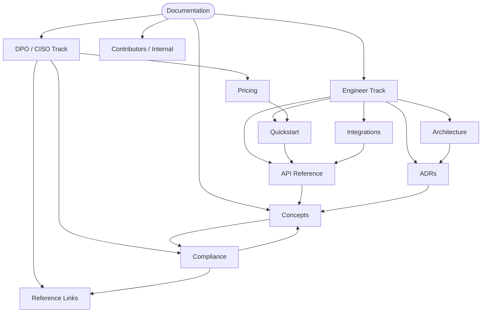

[BuildToValue](../README.md) › **Documentation**

 

<!-- audience: both -->

---

# BuildToValue Documentation

Governance gateway for AI agents — cryptographic evidence, LGPD / GDPR /
EU AI Act compliance, contestable decisions.

This documentation is organized into **two tracks**. Pick yours:

|  |  |
|---|---|
| 🛠️ **[Engineer Track →](./for-engineers.md)** | Quickstart, API, integrations, architecture, ADRs. For CTOs, Heads of AI Platform, developers. |
| 🛡️ **[DPO / CISO Track →](./for-dpo-ciso.md)** | Compliance, contestability, regulatory references, pricing. For DPOs, CISOs, legal. |

> The **[Concepts](./concepts.md)** page is the bridge between both tracks —
> recommended for both audiences.

---

## Documentation map

Click any box of the graph to open the corresponding document. The index
below is the text alternative, with descriptions. **Concepts** is the bridge
node: reachable from `API Reference` and from `Compliance`.

---

## Full index

### 🛠️ Engineer Track

| Document | Description |
|---|---|
| [Quickstart](./quickstart.md) | Install and make the first governed call. |
| [API Reference](./api-reference.md) | All gateway endpoints. |
| [Integrations](./integrations/index.md) | LangChain, LlamaIndex, CrewAI, AutoGen, MCP, SDKs. |
| [Architecture (Atlas)](./ARCHITECTURE_ATLAS.md) | Architecture view and v1.0 → v3.0 roadmap. |
| [ADR Index](./adr/0000-adr-index.md) | Every recorded architecture decision. |

### 🛡️ DPO / CISO Track

| Document | Description |
|---|---|
| [Compliance](./compliance.md) | LGPD, EU AI Act, HIPAA — compliance FAQ. |
| [Reference Links](./reference-links.md) | Internal links and official regulatory texts. |
| [Pricing](../PRICING.md) | Plans and billing model. |

### 🔗 Shared (both audiences)

| Document | Description |
|---|---|
| [Concepts](./concepts.md) | The Algorithmic Republic — how BTV decides. |
| [Changelog](./changelog.md) | Release notes. |
| [Project overview](../README.md) | Root README of the repository. |

### 🔒 Contributors / Internal

Documents aimed at the development squad — technical jargon, not part of the
public tracks.

| Document | Description |
|---|---|
| [Project Context](./PROJECT_CONTEXT.md) | Technical context for the development squad. |
| [Handoff Templates](./HANDOFF_TEMPLATES.md) | Architect → dev handoff templates. |
| [Release Gates](./RELEASE_GATES.md) | Release-gate checklist. |
| [Research Gaps v3](./RESEARCH_GAPS_v3.md) | Literature review and research gaps. |
| [File structure](./estruturaArquivos/data.md) | Map of the repository file tree. |
| [Reserved metadata layout](./adr/reserved_metadata_layout.md) | Reserved metadata layout — **not** the ADR set (see `docs/adr/`). |
| `roadmap.html` | Visual roadmap (HTML file, opens as raw). |

---

## Why BTV is different

|  | BTV | Generic guardrails | Manual filtering |
|---|---|---|---|
| **PII detection (LGPD)** | ✅ Native | ⚠️ Partial | ❌ You implement it |
| **Ethical reasoning** | ✅ Rawls / Levinas / Jonas / Gilligan | ❌ | ❌ |
| **Contestability** | ✅ LGPD Art. 20 + EU AI Act Art. 14 | ❌ | ❌ |
| **Per-session trust score** | ✅ Multi-factor | ❌ | ❌ |
| **HMAC-signed verdict** | ✅ Immutable | ❌ | ❌ |
| **Setup** | 5 min | Days | Weeks |

---

[🛠️ Engineer Track](./for-engineers.md) · [🛡️ DPO/CISO Track](./for-dpo-ciso.md) · [🔗 Reference Links](./reference-links.md) · [Concepts](./concepts.md)
