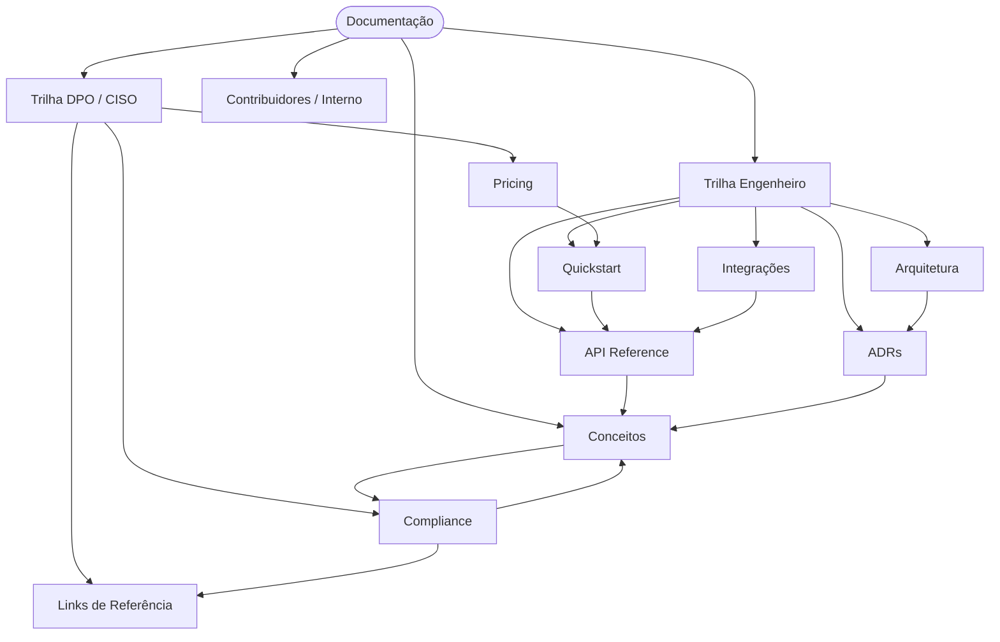

[BuildToValue](../README.md) › **Documentação**

 

<!-- audience: both -->

---

# Documentação BuildToValue

Gateway de governança para agentes de IA — evidência criptográfica, compliance
LGPD / GDPR / EU AI Act, decisões contestáveis.

Esta documentação é organizada em **duas trilhas**. Escolha a sua:

|  |  |
|---|---|
| 🛠️ **[Trilha Engenheiro →](./for-engineers.md)** | Quickstart, API, integrações, arquitetura, ADRs. Para CTO, Head of AI Platform, desenvolvedores. |
| 🛡️ **[Trilha DPO / CISO →](./for-dpo-ciso.md)** | Compliance, contestabilidade, referências regulatórias, pricing. Para DPO, CISO, jurídico. |

> A página **[Conceitos](./concepts.md)** é a ponte entre as duas trilhas — recomendada para ambos os públicos.

---

## Mapa da documentação

O grafo é um mapa visual; os links clicáveis estão no índice abaixo. **Conceitos** é
o nó-ponte: alcançável a partir de `API Reference` e de `Compliance`.

---

## Índice completo

### 🛠️ Trilha Engenheiro

| Documento | Descrição |
|---|---|
| [Quickstart](./quickstart.md) | Instale e faça a primeira chamada governada. |
| [API Reference](./api-reference.md) | Todos os endpoints do gateway. |
| [Integrações](./integrations/index.md) | LangChain, LlamaIndex, CrewAI, AutoGen, MCP, SDKs. |
| [Arquitetura (Atlas)](./ARCHITECTURE_ATLAS.md) | Visão de arquitetura e roadmap v1.0 → v3.0. |
| [Índice de ADRs](./adr/0000-adr-index.md) | Todas as decisões arquiteturais registradas. |

### 🛡️ Trilha DPO / CISO

| Documento | Descrição |
|---|---|
| [Compliance](./compliance.md) | LGPD, EU AI Act, HIPAA — FAQ de conformidade. |
| [Links de Referência](./reference-links.md) | Links internos e textos regulatórios oficiais. |
| [Pricing](../PRICING.md) | Planos e modelo de billing. |

### 🔗 Compartilhado (ambos os públicos)

| Documento | Descrição |
|---|---|
| [Conceitos](./concepts.md) | A República Algorítmica — como o BTV decide. |
| [Changelog](./changelog.md) | Notas de release. |
| [Visão geral do projeto](../README.md) | README raiz do repositório. |

### 🔒 Contribuidores / Interno

Documentos voltados à squad de desenvolvimento — jargão técnico, não fazem parte
das trilhas públicas.

| Documento | Descrição |
|---|---|
| [Project Context](./PROJECT_CONTEXT.md) | Contexto técnico para a squad de desenvolvimento. |
| [Handoff Templates](./HANDOFF_TEMPLATES.md) | Templates de handoff arquiteto → dev. |
| [Release Gates](./RELEASE_GATES.md) | Checklist de gates de release. |
| [Research Gaps v3](./RESEARCH_GAPS_v3.md) | Revisão de literatura e gaps de pesquisa. |
| [Estrutura de arquivos](./estruturaArquivos/data.md) | Mapa da árvore de arquivos do repositório. |
| [Reserved metadata layout](./adrs/reserved_metadata_layout.md) | Layout de metadados reservados — **não** é o conjunto de ADRs (ver `docs/adr/`). |
| `roadmap.html` | Roadmap visual (arquivo HTML, abre como raw). |

---

## Por que o BTV é diferente

|  | BTV | Guardrails genéricos | Filtering manual |
|---|---|---|---|
| **PII detection (LGPD)** | ✅ Nativo | ⚠️ Parcial | ❌ Você implementa |
| **Raciocínio ético** | ✅ Rawls / Levinas / Jonas / Gilligan | ❌ | ❌ |
| **Contestabilidade** | ✅ LGPD Art. 20 + EU AI Act Art. 14 | ❌ | ❌ |
| **Trust score por sessão** | ✅ Multi-fatorial | ❌ | ❌ |
| **Verdict assinado (HMAC)** | ✅ Imutável | ❌ | ❌ |
| **Setup** | 5 min | Dias | Semanas |

---

[🛠️ Trilha Engenheiro](./for-engineers.md) · [🛡️ Trilha DPO/CISO](./for-dpo-ciso.md) · [🔗 Links de Referência](./reference-links.md) · [Conceitos](./concepts.md)
