# Arquitetura Completa — BuildToValueGovernance

> **Documento de arquitetura de todo o repositório** em modelo **C4** (Contexto → Contêiner → Componente → Código) mais **vistas transversais** (fluxos de dados, máquinas de estado, segurança, persistência, implantação e CI/CD).
> Todos os elementos foram extraídos por **análise estática direta do código-fonte deste repositório** — cada bloco cita os arquivos de origem. Diagramas em **Mermaid** (validados).
> Complementa o [Documento UML](arquitetura-uml.md) (nível de classes/sequência); aqui o foco é a **arquitetura de sistema**.

---

## Índice de vistas

| # | Vista | Nível C4 / tipo |
|---|---|---|
| 1 | [Contexto de Sistema](#1--c4-nível-1--contexto-de-sistema) | C4 L1 |
| 2 | [Contêineres](#2--c4-nível-2--contêineres) | C4 L2 |
| 3 | [Componentes por serviço](#3--c4-nível-3--componentes) | C4 L3 |
| 4 | [Fluxos de dados (DFD)](#4--fluxos-de-dados) | DFD |
| 5 | [Máquinas de estado](#5--máquinas-de-estado) | State |
| 6 | [Arquitetura de segurança](#6--arquitetura-de-segurança) | Security |
| 7 | [Arquitetura de persistência](#7--arquitetura-de-persistência) | Data |
| 8 | [Topologias de implantação](#8--topologias-de-implantação) | Deployment |
| 9 | [Pipeline de CI/CD](#9--pipeline-de-cicd) | Build |
| 10 | [Mapa de invariantes fail-secure](#10--mapa-de-invariantes-fail-secure) | Cross-cutting |
| 11 | [Rastreabilidade arquivo → componente](#11--rastreabilidade-arquivo--componente) | Índice |

**Convenção de cores C4:** 🟦 pessoa/ator · 🟩 sistema/contêiner interno · 🟨 componente · ⬜ sistema externo.

---

## 1 · C4 Nível 1 — Contexto de Sistema

**Objetivo:** situar o sistema entre seus usuários e sistemas externos.

**Escopo:** todo o repositório visto como uma caixa-preta.

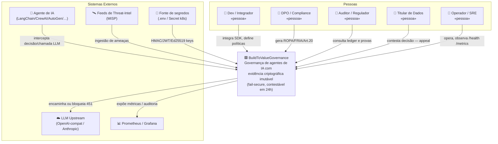

**Notas de design:**
- O **agente de IA** é simultaneamente cliente e sujeito da governança — o sistema fica no caminho crítico entre o agente e o LLM.
- Todos os segredos são **injetados externamente** (`.env` / Secret k8s), nunca embarcados — pré-requisito do modelo fail-closed das chaves (`rust/kernel/src/keys.rs`, `python/buildtovalue/security/keys.py`).

---

## 2 · C4 Nível 2 — Contêineres

**Objetivo:** os processos executáveis do repositório e como se comunicam.

**Escopo:** artefatos de runtime derivados de `rust/` (12 crates), `python/`, `sdk/` e `ops/`.

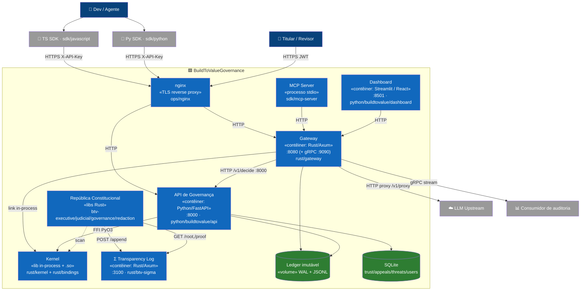

**Legenda de portas:** gateway **8080** · governança **8000** · Σ **3100** · gRPC auditoria **9090** · dashboard **8501** · playground **8502** · Prometheus **9090** · Grafana **3000** · nginx TLS **8443/9443** (dev) ou **80/443** (prod).

**Notas de design:**
- **Dois caminhos ao kernel:** o gateway o linka em processo (`rust/gateway/Cargo.toml` → `buildtovalue-kernel`); a API Python o chama por FFI (`python/buildtovalue/governance/ffi_client.py`). Convergem em `Gatekeeper::scan_for_evidence`.
- A **República Constitucional** é um subsistema pura-Rust separado (Papers 5/6) que se comunica **exclusivamente através de Σ** — não importa nem chama o gateway/Python.

---

## 3 · C4 Nível 3 — Componentes

### 3.1 Componentes do Gateway (Rust)

**Escopo:** `rust/gateway/src/**`.

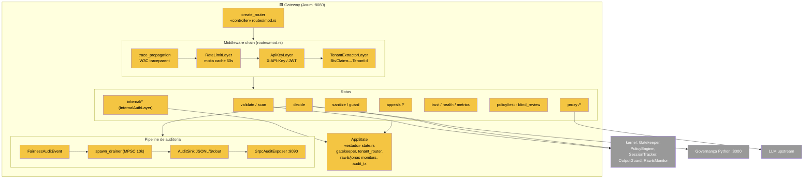

**Notas:** o gateway acumula borda de segurança + scan + proxy + auditoria; `AppState` centraliza tudo (SPOF operacional mitigado por statelessness por tenant via `TenantStorageRouter`). A auditoria é **desacoplada** por MPSC com *drop-on-full*.

### 3.2 Componentes da API de Governança (Python)

**Escopo:** `python/buildtovalue/{api,governance,compliance,intelligence,agentic,core}`.

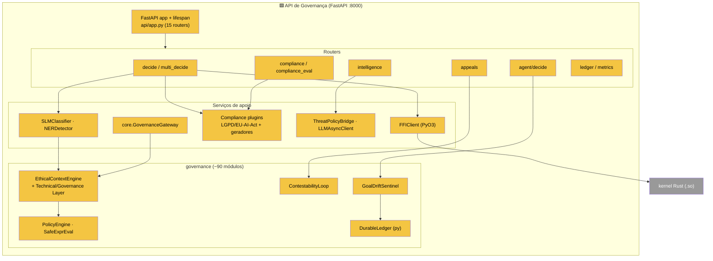

**Notas:** todos os singletons são injetados em `app.state` no `lifespan` (ADR-0093, sem globais). O pacote `governance` é o núcleo de domínio e o principal candidato a subdivisão.

### 3.3 Componentes do Kernel (Rust)

**Escopo:** `rust/kernel/src/**` (ver detalhamento de classes no [doc UML §5.1–5.2](arquitetura-uml.md#51--rust--kernel-pipeline-de-evidência)).

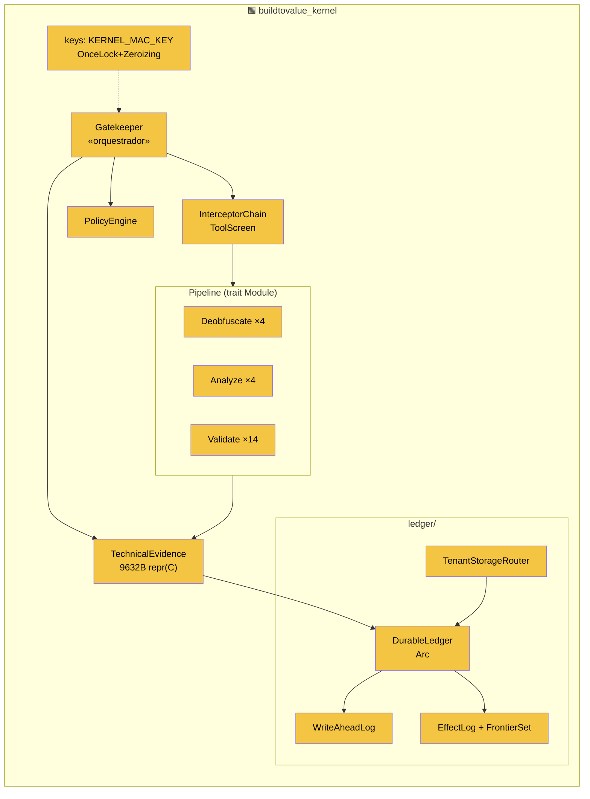

### 3.4 Componentes da República Constitucional (Rust)

**Escopo:** `rust/{btv-core,btv-executive,btv-judicial,btv-governance,btv-redaction,btv-sigma,btv-types}` (detalhe de classes no [doc UML §5.3](arquitetura-uml.md#53--rust--república-constitucional-tipos-lineares)).

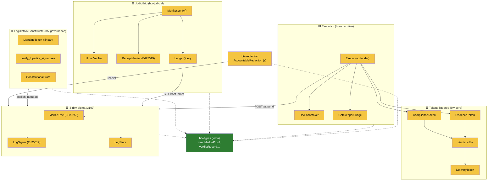

**Notas:** invariante de CI (`crate_release_audit.yml`, `fail_secure_ci.yml`) — J/Σ/redaction **não** dependem de btv-core; governança **não** importa executivo. Comunicação entre poderes só via Σ.

### 3.5 Componentes de SDK & Integrações

**Escopo:** `sdk/**`.

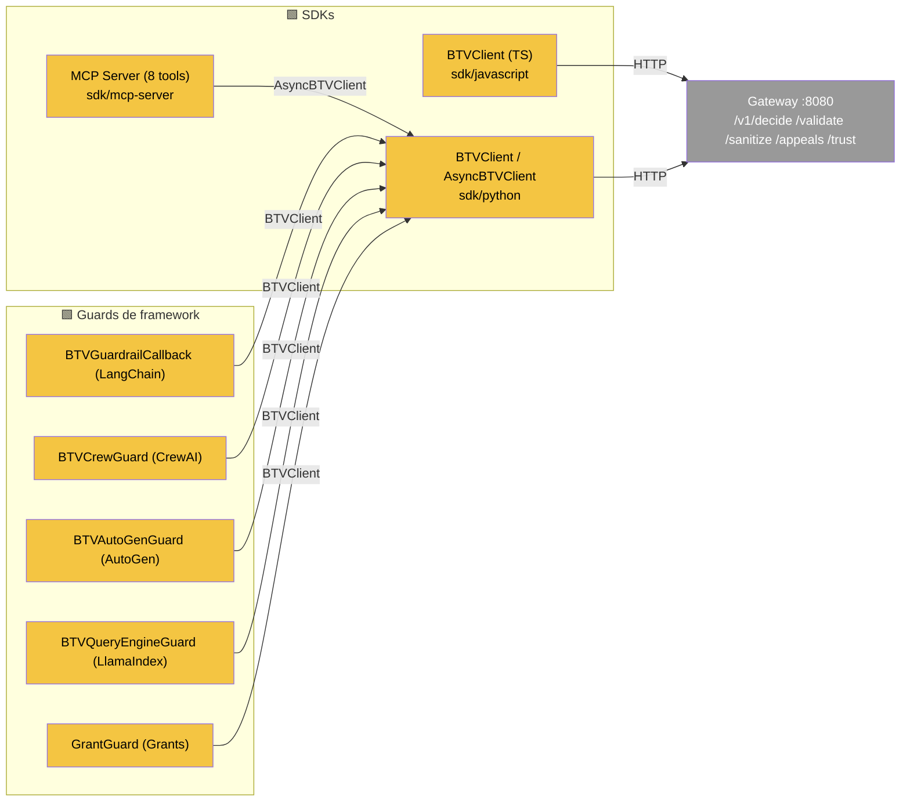

**Notas:** paridade de API entre TS e Python (mesmo mapa de endpoints, mesma hierarquia de erros, retry 2/4/8s). Guards de framework dependem só do SDK Python (baixo acoplamento). MCP expõe 5 tools proxy (`validate/decide/appeal/trust/compliance`) + 3 locais (`elicit_policy/negotiate/select_protocol`).

---

## 4 · Fluxos de dados

### 4.1 Ciclo de vida de uma decisão (proxy transparente)

**Objetivo:** o dado (prompt do agente) atravessando o sistema até ALLOW/BLOCK.

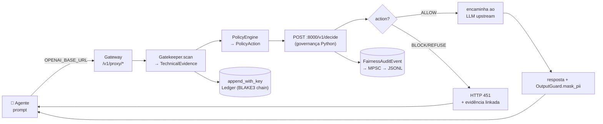

### 4.2 Ciclo de vida da evidência (criação → ledger → verificação independente)

**Objetivo:** como a evidência vira prova verificável e não-repudiável.

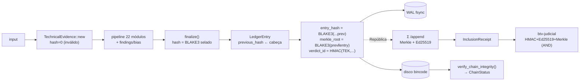

**Nota:** WAL-first garante recuperação pós-crash (`recover()` SLA < 5 s). Adulterar qualquer registro ⇒ `ChainStatus::TamperedAt`.

### 4.3 Threat-intel → política (human-in-the-loop)

**Objetivo:** transformar ameaças externas em políticas, sem ativação automática.

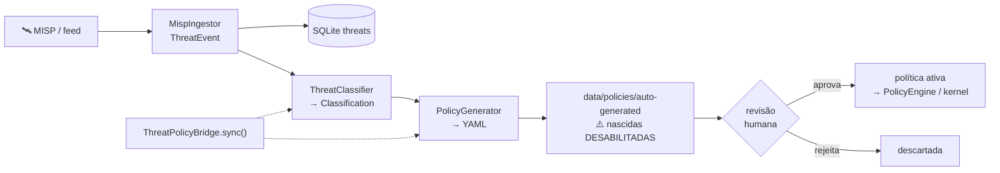

### 4.4 Auditoria de fairness (não-bloqueante → stream gRPC)

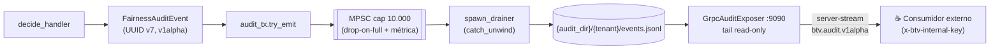

---

## 5 · Máquinas de estado

### 5.1 Negociação Agente-a-Agente

**Escopo:** `python/buildtovalue/agentic/negotiation_engine.py` (`NegotiationState`).

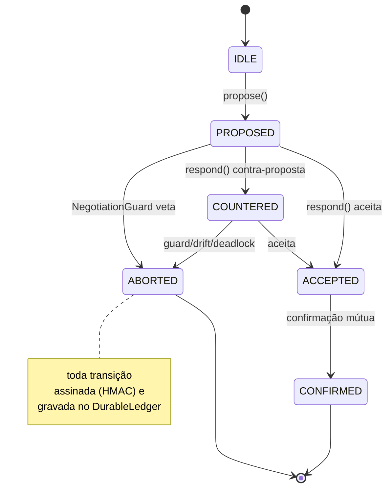

### 5.2 Estado constitucional / mandato

**Escopo:** `rust/btv-governance/src/{constitutional_state,mandate}.rs`.

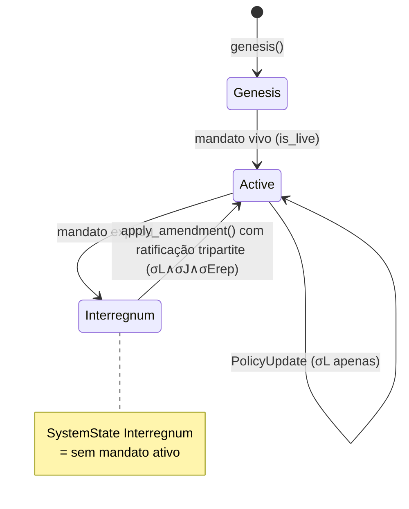

### 5.3 Circuit breaker do cliente LLM

**Escopo:** `python/buildtovalue/intelligence/llm_async_client.py` (`CircuitState`).

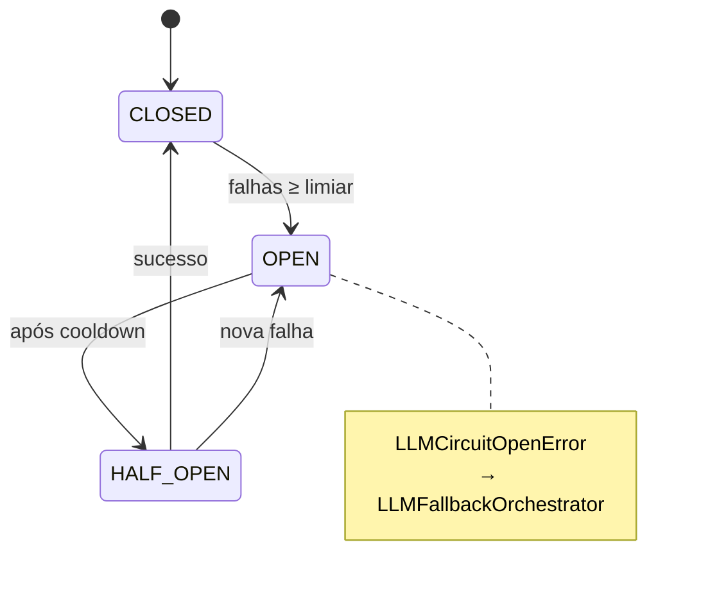

### 5.4 Contestação (Appeal)

**Escopo:** `governance/contestability/_types.py` (`AppealStatus`) + `/v1/appeals`.

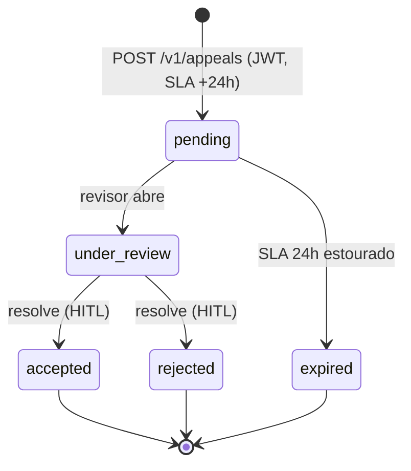

### 5.5 Reversibilidade de efeito (EffectLog)

**Escopo:** `rust/kernel/src/ledger/effect_log.rs` (`Reversibility` × `EffectResult`).

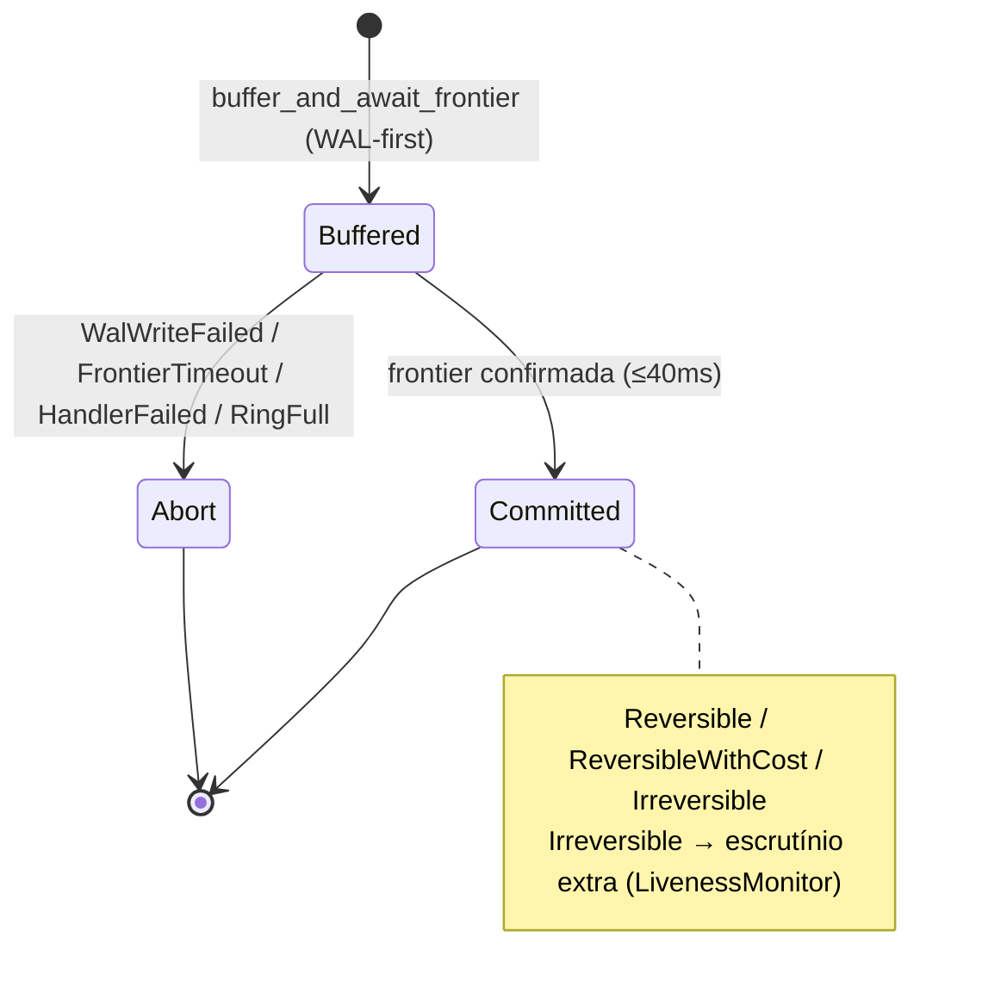

---

## 6 · Arquitetura de segurança

### 6.1 Cadeia de autenticação/autorização (gateway)

**Escopo:** `rust/gateway/src/middleware/*.rs`.

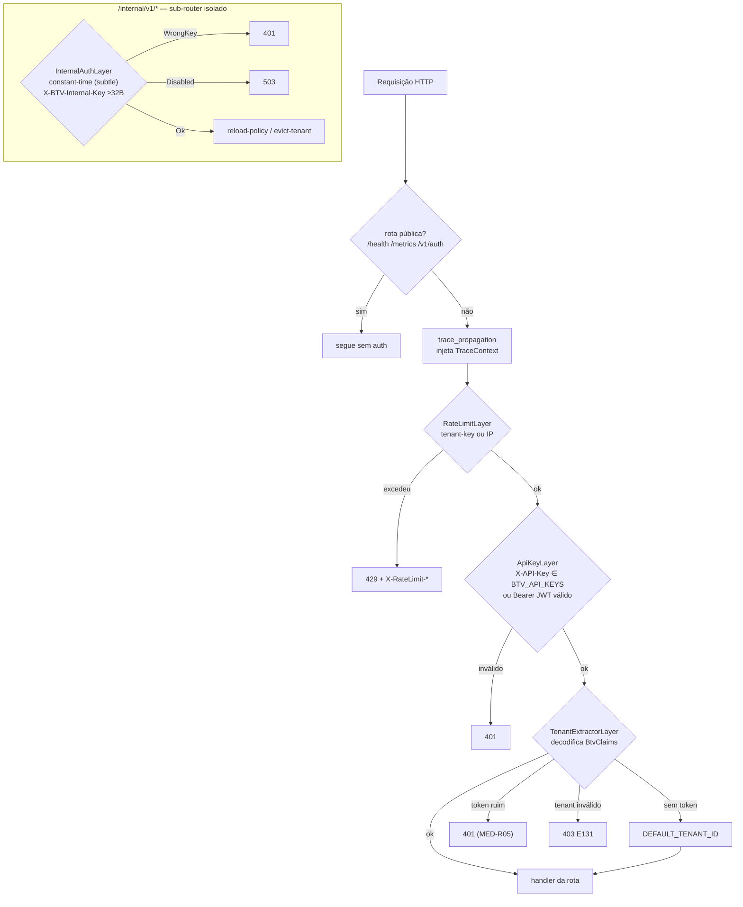

### 6.2 Hierarquia de chaves e segredos

**Escopo:** `rust/kernel/src/keys.rs`, `python/buildtovalue/security/keys.py`, crates btv-*.

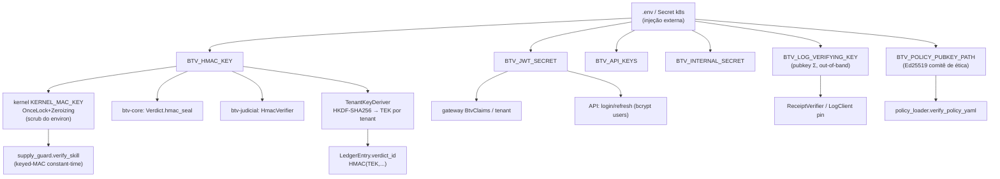

**Notas:** chaves **fail-closed em produção** (`keys.rs` aborta se ausente); comparações sempre **constant-time** (`subtle`, `btv_types::crypto_utils::constant_time_eq`); `BTV_HMAC_KEY` é apagado do environ após init.

### 6.3 Isolamento multi-tenant

**Escopo:** `rust/kernel/src/ledger/tenant_router.rs`, `gateway/src/middleware/tenant_extractor.rs`.

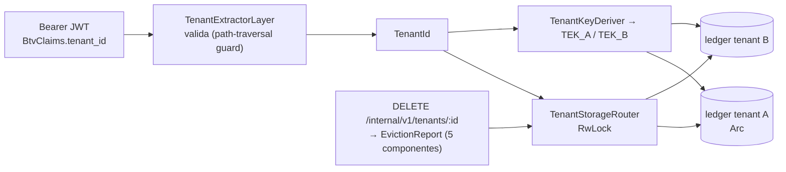

### 6.4 Camadas criptográficas

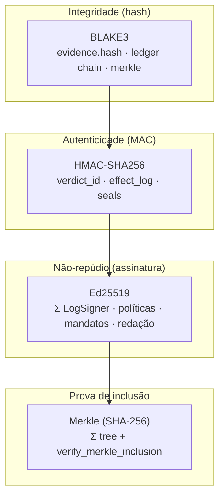

**Nota:** duas famílias de Merkle coexistem — canônica `min(a,b)` em Σ/btv-types e ordenada por lado (`ProofSide`) em btv-judicial (`merkle_verify.rs`).

---

## 7 · Arquitetura de persistência

**Objetivo:** todos os armazenamentos e como se relacionam.

**Escopo:** `rust/kernel/src/ledger/`, `python/buildtovalue/{api/_db.py,api/ledger_reader.py,security/db.py}`, `ops/`.

```mermaid
flowchart TB
    subgraph rustled["Ledger imutável (Rust)"]
        wal[("WAL<br/>evidence snapshot fsync")]
        disk[("disco bincode<br/>LedgerEntry 384B encadeado")]
        eff[("EffectLog<br/>ring [64] em memória")]
        sess[("SessionAggregator<br/>ring [256] em memória")]
    end
    subgraph pyled["Ledger analítico (Python)"]
        jsonl[("data/ledger/decisions.jsonl<br/>append-only")]
    end
    subgraph sqlite["SQLite (WAL mode)"]
        trust[("trust / sessions")]
        appeals[("appeals")]
        threats[("threats")]
        users[("users (bcrypt)")]
    end
    subgraph sig["Σ"]
        merkle[("MerkleTree (InMemoryStore<br/>trocável por RocksDB/PG)")]
    end
    subgraph vol["Volumes / k8s"]
        led_data[("ledger_data (Compose)")]
        pvc_led[("PVC ledger 50Gi")]
        pvc_exp[("PVC explanations 100Gi")]
        pg[("Postgres + Redis (k8s Secret)")]
    end

    router["TenantStorageRouter"] --> disk
    disk --> wal
    disk --> eff & sess
    disk --- led_data
    disk --- pvc_led
    jsonl --- led_data
    LedgerReader["api.LedgerReader.query"] --> jsonl
    LedgerAnalytics["compliance.LedgerAnalytics"] --> jsonl
    appeals --> ContestabilityLoop
    disk --> verifychain["verify_chain_integrity → ChainStatus"]
```

**Notas:** há **dois ledgers** — o canônico criptográfico do kernel (WAL + bincode encadeado, por tenant) e um JSONL analítico no Python (consumido por `LedgerReader`/`LedgerAnalytics` para ROPA/Art.20/métricas). No Compose ambos compartilham o volume `ledger_data`. **Limitação conhecida:** sem rotação de ledger (cresce indefinidamente).

---

## 8 · Topologias de implantação

### 8.1 Quickstart (`ops/docker-compose.quickstart.yml`)

```mermaid
flowchart LR
    u["👤 :8501 dashboard"] --> dash["dashboard<br/>Dockerfile.streamlit-demo"]
    dash --> gw["gateway :8080<br/>Dockerfile.rust"]
    gw -->|:8000| gov["governance<br/>Dockerfile.python-quickstart"]
    gw -->|proxy| mock["upstream-mock :8082<br/>httpbin"]
    gw --- led[("ledger_data")]
    gov --- led
```

### 8.2 Produção Compose + observabilidade (`ops/docker-compose.yml`)

```mermaid
flowchart TB
    internet["🌐"] --> nginx["nginx :8443/:9443<br/>TLS"]
    nginx --> gw["gateway :8080 (+gRPC :9090)<br/>serve dashboard React"]
    nginx --> gov["governance :8000<br/>CUDA 12.4 · mem 6G/4cpu"]
    gw -->|:8000| gov
    gw --- led[("ledger_data")]
    gov --- led
    prom["prometheus :9090"] -->|scrape /metrics| gw
    graf["grafana :3000"] --> prom
    play["playground :8502"] --> gw
    dashl["dashboard-legacy :8501"] --> gw & gov
```

**Variantes:** `docker-compose.e2e.yml` (gateway pré-buildado `Dockerfile.rust-ci` + go-httpbin, adiciona `BTV_JWT_SECRET`); `docker-compose.gpu.yml` (reserva GPU NVIDIA na governança); `docker-compose.vps.yml` (único `nginx-prod` :80/:443 como ingress, redes externas + letsencrypt).

### 8.3 Kubernetes (`ops/k8s/`)

```mermaid
flowchart TB
    subgraph ns["ns: buildtovalue (PSS restricted)"]
        ing["Ingress nginx<br/>api.buildtovalue.com<br/>TLS cert-manager · 100rps"]
        svc["Service ClusterIP<br/>80→8000 · 9090 metrics<br/>sessionAffinity ClientIP"]
        dep["Deployment buildtovalue<br/>replicas 3 · RollingUpdate maxUnavailable 0<br/>initContainer validate-policies<br/>runAsNonRoot · podAntiAffinity"]
        depc["Deployment compliance<br/>replicas 3 · WAL PVC"]
        hpa["HPA 3–10<br/>CPU70% · Mem80% · p99 30ms"]
        pvc[("PVC ledger 50Gi<br/>PVC explanations 100Gi")]
        sec["Secret: DATABASE_URL(PG)<br/>REDIS_URL · SIGNING_KEY"]
        np["NetworkPolicy<br/>egress: DNS/PG/Redis/HTTPS"]
    end
    argocd["ArgoCD Application<br/>GitOps sync prune+selfHeal"] -.-> dep
    ing --> svc --> dep
    hpa --> dep
    dep --- pvc & sec
    np -.-> dep
```

### 8.4 Fly.io (`fly.toml`)

```mermaid
flowchart LR
    fly["app buildtovalue-gateway<br/>região gru · Dockerfile.rust<br/>internal_port 8080 · force_https<br/>512mb/1cpu · check GET /health"] -->|BTV_GOVERNANCE_URL<br/>https://governance.buildtovalue.io| ext["governança (externa)"]
```

---

## 9 · Pipeline de CI/CD

**Objetivo:** os portões de qualidade que protegem os invariantes arquiteturais.

**Escopo:** `.github/workflows/*.yml`.

```mermaid
flowchart TB
    push["push / pull_request"] --> gate

    subgraph gate["Portões (GitHub Actions)"]
        direction TB
        fs["fail_secure_ci<br/>merkle-consistency · bindings-build<br/>no-stubs · python-ffi · gate"]:::sec
        cp3["constitutional-phase3<br/>constitutional-boundaries · unit-tests<br/>gateway-unit · pipeline-with-sigma<br/>evidence-size · latency-benchmark"]:::sec
        crate["crate_release_audit<br/>workspace_integrity + dry_run<br/>(isolamento de crates)"]:::sec
        align["alignment_regression<br/>golden_tests"]:::test
        battery["btv_battery_v2<br/>Security Coverage"]:::test
        blind["policy-blind-test<br/>Rawls (ADR-042)"]:::test
        ci["ci (Grant Adapter)<br/>weeks 1-4 + full-pipeline"]:::test
        e2e["e2e<br/>Proxy HTTP transparente"]:::test
        lint["lint-guards<br/>bandit · cargo-audit<br/>trufflehog · coverage"]:::lint
        proto["proto<br/>breaking (contrato gRPC)"]:::lint
        docs["docs<br/>build MkDocs"]:::lint
    end

    gate --> merge{"todos verdes?"}
    merge -->|sim| ok["merge / deploy (ArgoCD)"]
    merge -->|não| block["bloqueia PR"]

    classDef sec fill:#c62828,color:#fff
    classDef test fill:#1565c0,color:#fff
    classDef lint fill:#6a1b9a,color:#fff
```

**Notas:** CI **codifica os invariantes de arquitetura** — `crate_release_audit` garante o isolamento de crates (J/Σ sem btv-core); `fail_secure_ci/no-stubs` proíbe stubs em caminhos de segurança; `constitutional-phase3/evidence-size` fixa 9632B da evidência; `latency-benchmark` protege o SLA; `trufflehog`/`bandit`/`cargo-audit` cobrem segredos e vulnerabilidades.

---

## 10 · Mapa de invariantes fail-secure

**Objetivo:** vista transversal do princípio que unifica o sistema — **o estado padrão é o bloqueio**.

```mermaid
flowchart TB
    inv["🔒 Invariante global:<br/>falha ⇒ negação"]

    inv --> k["Kernel<br/>TechnicalEvidence nasce hash=0 (inválida);<br/>3 portões emitem Finding crítico;<br/>#[must_use] → erro de build"]
    inv --> ffi["FFI<br/>PyO3-only, sem fallback;<br/>ImportError → BridgeNotAvailableError"]
    inv --> py["Governança Python<br/>exceção em qualquer etapa → BLOCK assinado;<br/>singleton 503 → fail-secure"]
    inv --> gw["Gateway<br/>proxy nega (451) por padrão;<br/>token ruim → 401 (MED-R05)"]
    inv --> exec["Executivo<br/>DecisionError sem variante parcial;<br/>sem recibo Σ ⇒ sem entrega"]
    inv --> keys["Chaves<br/>fail-closed em produção;<br/>comparação constant-time"]
    inv --> ci["CI<br/>no-stubs · evidence-size ·<br/>isolamento de crates"]
```

---

## 11 · Rastreabilidade arquivo → componente

| Componente (diagrama) | Origem no repositório |
|---|---|
| Gateway (rotas/middleware/estado/auditoria) | `rust/gateway/src/{routes,middleware,state.rs,audit}` |
| Kernel Gatekeeper + pipeline | `rust/kernel/src/{gatekeeper.rs,core,evidence,deobfuscator,interceptor}` |
| Ledger imutável | `rust/kernel/src/ledger/{durable_ledger,wal,effect_log,entry,tenant_router}.rs` |
| Tokens lineares / Executivo | `rust/btv-core/src/*`, `rust/btv-executive/src/*` |
| Σ Transparency Log | `rust/btv-sigma/src/{api,merkle,signer,store}.rs` |
| Judiciário / Governança / Redação | `rust/btv-{judicial,governance,redaction}/src/*` |
| Tipos wire compartilhados | `rust/btv-types/src/{lib,crypto_utils,merkle_verify}.rs` |
| FFI (PyO3 + C-ABI) | `rust/bindings/src/*`, `rust/kernel/src/ffi/*`, `python/buildtovalue/{ffi,governance/ffi_client.py}` |
| API FastAPI + routers | `python/buildtovalue/api/{app.py,_lifespan.py,routes/*}` |
| Ethical Context Engine + camadas | `python/buildtovalue/governance/{ethical_context_engine,ece_technical,ece_governance}.py` |
| Compliance (plugins + geradores) | `python/buildtovalue/compliance/*` |
| Intelligence (SLM/NER/threat) | `python/buildtovalue/intelligence/*` |
| Agentic (negociação A2A) | `python/buildtovalue/agentic/*` |
| Orquestradores core | `python/buildtovalue/core/{governance_gateway,tool_call_router}.py` |
| Segurança (chaves/DB) | `python/buildtovalue/security/{keys,db}.py`, `rust/kernel/src/keys.rs` |
| SDKs / MCP / integrações | `sdk/{javascript,python,mcp-server,integrations}/*` |
| Implantação | `ops/{docker-compose*.yml,Dockerfile.*,k8s,nginx,prometheus.yml}`, `fly.toml` |
| CI/CD | `.github/workflows/*.yml` |
| Contratos | `spec/{openapi.yaml,agent-pdp-v1.json}` |

---

> **Fidelidade.** Nenhum elemento deste documento foi inferido de material de marketing — todos derivam de leitura direta dos arquivos citados. Para o nível de classes/sequência detalhado, ver o [Documento UML](arquitetura-uml.md).

