# Documentação UML — BuildToValue (BTV) Governance

> **Análise arquitetural completa multi-linguagem (Python · Rust · TypeScript).**
> Documento gerado por engenharia reversa estática do repositório para estudo de arquitetura e planejamento de refatoramentos.
> Diagramas em **Mermaid** (renderizável no GitHub e no MkDocs).

---

## Índice

0. [Visão geral e metodologia](#0--visão-geral-e-metodologia)
1. [Mapa estrutural e fronteiras de sistema](#1--mapa-estrutural-e-fronteiras-de-sistema)
2. [Diagrama de Casos de Uso](#2--diagrama-de-casos-de-uso)
3. [Diagrama de Pacotes](#3--diagrama-de-pacotes)
4. [Diagrama de Componentes](#4--diagrama-de-componentes)
5. [Diagramas de Classes](#5--diagramas-de-classes)
   - 5.1 [Rust — Kernel (pipeline de evidência)](#51--rust--kernel-pipeline-de-evidência)
   - 5.2 [Rust — Ledger imutável](#52--rust--ledger-imutável)
   - 5.3 [Rust — República Constitucional (tipos lineares)](#53--rust--república-constitucional-tipos-lineares)
   - 5.4 [Fronteira FFI Python ↔ Rust](#54--fronteira-ffi-python--rust)
   - 5.5 [Python — Camada de Governança (Ethical Context Engine)](#55--python--camada-de-governança-ethical-context-engine)
   - 5.6 [Python — API, Compliance e Intelligence](#56--python--api-compliance-e-intelligence)
   - 5.7 [Python — Agentic (negociação A2A)](#57--python--agentic-negociação-a2a)
   - 5.8 [TypeScript / Python SDK](#58--typescript--python-sdk)
6. [Diagramas de Sequência](#6--diagramas-de-sequência)
   - 6.1 [`POST /v1/decide` via Gateway](#61--post-v1decide-via-gateway)
   - 6.2 [Scan FFI Python → Rust Kernel](#62--scan-ffi-python--rust-kernel)
   - 6.3 [República Constitucional: Executivo → Σ → Judiciário](#63--república-constitucional-executivo--σ--judiciário)
   - 6.4 [Negociação Agente-a-Agente (A2A)](#64--negociação-agente-a-agente-a2a)
   - 6.5 [Contestação (Appeal) com SLA de 24h](#65--contestação-appeal-com-sla-de-24h)
7. [Diagramas de Atividades](#7--diagramas-de-atividades)
   - 7.1 [Pipeline do Gatekeeper (22 módulos, fail-secure)](#71--pipeline-do-gatekeeper-22-módulos-fail-secure)
   - 7.2 [Cadeia de guardas de `/v1/agent/decide`](#72--cadeia-de-guardas-de-v1agentdecide)
   - 7.3 [Consumo de tokens lineares no Executivo](#73--consumo-de-tokens-lineares-no-executivo)
8. [Diagrama de Implantação](#8--diagrama-de-implantação)
9. [Análise de coesão, acoplamento e refatoramento](#9--análise-de-coesão-acoplamento-e-refatoramento)

---

## 0 · Visão geral e metodologia

**BuildToValue (BTV)** é uma infraestrutura de **governança de agentes de IA com evidência criptográfica imutável**. Toda decisão/chamada LLM é interceptada, validada contra LGPD/GDPR/EU AI Act/HIPAA e auditada com um recibo de evidência selado por BLAKE3 + HMAC-SHA256, contestável em 24h. O estado padrão é **fail-secure**: qualquer falha resulta em bloqueio.

O sistema é poliglota por design, com uma separação clara de responsabilidades por linguagem:

| Linguagem | Papel | Latência-alvo | Arquivos-fonte |
|---|---|---|---|
| **Rust** | Hot path: scan de evidência, criptografia, ledger, sidecar HTTP e a "República Algorítmica" constitucional | < 30 ms p99 (gateway); ~1,67 µs (scan) | ~299 `.rs` |
| **Python** | Pipeline ético/compliance, API FastAPI, inteligência (SLM/NER/threat-intel), negociação multi-agente, dashboard | < 10 ms p99 (governança) | ~407 `.py` |
| **TypeScript** | SDK cliente para o gateway (única superfície de front-end) | — | 5 `.ts` |

**Metodologia aplicada:** (1) mapeamento estrutural top-down dos workspaces (`rust/Cargo.toml`, `python/pyproject.toml`, `sdk/javascript/package.json`); (2) análise estática de todas as structs/enums/traits/classes/interfaces e suas relações; (3) identificação de padrões arquiteturais (separação de poderes, tipos lineares, plugin, circuit breaker, fail-secure, ledger hash-chained); (4) construção dos diagramas.

### Legenda global de estereótipos

| Estereótipo | Significado |
|---|---|
| `«entity»` | Objeto de domínio com identidade/persistência |
| `«value-object»` / `«dto»` | Dado imutável transportado entre camadas |
| `«service»` | Orquestrador de lógica de negócio |
| `«repository»` | Acesso a persistência (ledger, SQLite, disco) |
| `«controller»` | Handler HTTP (rota FastAPI/Axum) |
| `«detector»` / `«validator»` / `«guard»` | Módulo de análise/veto de segurança |
| `«linear»` | Tipo Rust de uso único (sem `Clone`/`Copy`, `#[must_use]`) |
| `«trait»` / `«interface»` / `«protocol»` | Contrato abstrato |

---

## 1 · Mapa estrutural e fronteiras de sistema

### 1.1 Árvore de diretórios anotada por linguagem

```
BuildToValueGovernance/
├── rust/                       🦀 workspace Cargo (12 crates)
│   ├── btv-types/              ── tipos wire compartilhados (folha do grafo)
│   ├── kernel/                 ── Gatekeeper: scan de 22 módulos + ledger durável
│   ├── btv-core/               ── tokens lineares (Evidence⊗Compliance→Verdict)
│   ├── btv-sigma/              ── Σ: Transparency Log (Merkle + Ed25519), bin HTTP :3100
│   ├── btv-executive/          ── Poder Executivo (Decide→Deliver)
│   ├── btv-judicial/           ── Poder Judiciário (verificação independente)
│   ├── btv-governance/         ── Poder Constituinte (mandatos, emendas)
│   ├── btv-redaction/          ── Redação acautelável (ZK-SNARK, modo direto)
│   ├── gateway/                ── sidecar Axum HTTP :8080 (rotas + middleware + auditoria gRPC)
│   ├── bindings/               ── FFI PyO3 + C-ABI (buildtovalue_kernel)
│   ├── cli/  buildtovalue/     ── CLI placeholder + fachada de re-export
├── python/buildtovalue/        🐍 pacote FastAPI + governança
│   ├── governance/             ── ~90 módulos: ethical context engine, políticas, appeals, drift…
│   ├── api/                    ── app FastAPI + 15 routers
│   ├── compliance/             ── plugins LGPD/EU-AI-Act + geradores ROPA/FRIA/Art.20
│   ├── intelligence/           ── LLM async, SLM/NER, threat-intel → policy bridge
│   ├── agentic/                ── negociação A2A + arena
│   ├── core/                   ── GovernanceGateway, ToolCallRouter
│   ├── ffi/                    ── wrappers ctypes/PyO3 para o kernel Rust
│   ├── dashboard/              ── app Streamlit (operador/DPO)
│   ├── observability/ security/── logging/métricas/tracing + chaves HMAC
├── sdk/
│   ├── javascript/             📘 SDK TypeScript (@buildtovalue/sdk)
│   ├── python/                 ── SDK Python cliente (BTVClient)
│   ├── mcp-server/             ── servidor Model Context Protocol (stdio)
│   └── integrations/           ── guards LangChain/CrewAI/AutoGen/LlamaIndex/Grants
├── ops/                        🚢 Docker Compose, Dockerfiles, k8s, nginx, prometheus
└── spec/                       📄 openapi.yaml + agent-pdp-v1.json (contratos)
```

### 1.2 Fronteiras de sistema e mecanismos de comunicação

Existem **duas topologias de execução** que coexistem no repositório:

1. **Sidecar operacional (produção padrão):** SDKs/frameworks → **HTTP/REST** → **Gateway Rust (:8080)** que chama o **kernel in-process** e delega a decisão ética por **HTTP** à **API Python de governança (:8000)**; proxy transparente encaminha ao **LLM upstream**.
2. **República Constitucional pura-Rust (Papers 5/6):** `btv-executive` → **HTTP** → `btv-sigma (Σ, :3100)` ← **HTTP** ← `btv-judicial`, com `btv-governance` publicando mandatos em Σ. Os poderes **não se importam mutuamente** (invariante de CI).

Além disso, a API Python invoca o kernel Rust **in-process via FFI** (PyO3), independente do gateway.

| Fronteira | Protocolo | Contrato |
|---|---|---|
| SDK/framework → Gateway | HTTP/REST JSON, header `X-API-Key` / Bearer JWT | `spec/openapi.yaml` |
| Gateway → Governança Python | HTTP/REST (`BTV_GOVERNANCE_URL`, :8000) | `/v1/decide`, `/v1/appeals/*`, `/v1/trust/{s}`, `/v1/bias/status` |
| Gateway → LLM upstream | HTTP proxy (`/v1/proxy/*` → `BTV_PROXY_UPSTREAM_URL`) | passthrough OpenAI-compat |
| Python ↔ Rust kernel | **FFI**: PyO3 (`buildtovalue_kernel`) + C-ABI (`ctypes`) | JSON (serde) / structs `#[repr(C)]` |
| Executivo/Judiciário/Governança → Σ | HTTP (`/append`, `/root`, `/proof/{i}`) | `btv-types` wire (Merkle, Ed25519) |
| Gateway → consumidor de auditoria | **gRPC** server-streaming (`btv.audit.v1alpha`, :9090) | prost/tonic |
| Agente ↔ MCP server | **MCP over stdio** (JSON-RPC) | 8 tools |
| Agente-PDP externo | JSON-Schema `agent-pdp-v1.json` (ADR-029) | via `agent_id` em `/v1/decide` |

### 1.3 Dependências externas por linguagem

- **Rust:** `axum`, `tonic`/`prost` (gRPC), `blake3`, `ed25519-dalek`, `hmac`/`sha2`, `ring`, `pyo3`, `tokio`, `moka` (cache de rate-limit), `regex`, `whatlang` (detecção de idioma), `rusqlite`, `aws-sdk-s3`, `opentelemetry`, `prometheus`.
- **Python:** `fastapi`, `pydantic v2`, `uvicorn`, `httpx`, `slowapi` (rate-limit), `PyJWT`+`cryptography`+`bcrypt`, `blake3`, `llama-cpp-python` (SLM opcional), `streamlit`.
- **TypeScript:** zero dependências de runtime (usa `fetch` nativo, Node 18+).

---

## 2 · Diagrama de Casos de Uso

**Objetivo:** identificar os atores e as funcionalidades de alto nível expostas pelo sistema.

**Escopo:** toda a superfície pública — rotas HTTP do gateway e da API Python, CLI, MCP e o triângulo constitucional.

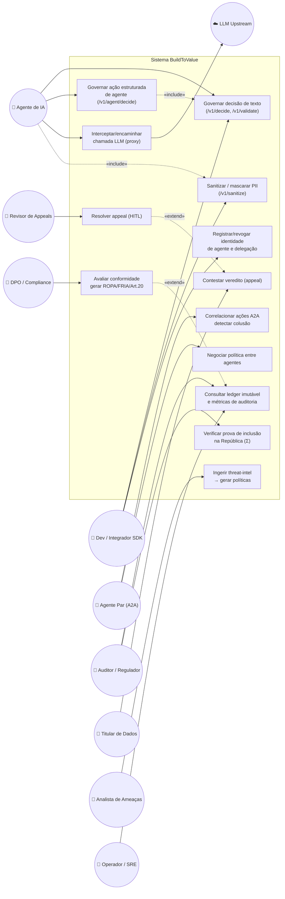
```mermaid
flowchart LR
    dev(("👤 Dev / Integrador SDK"))
    agent(("🤖 Agente de IA"))
    peer(("🤖 Agente Par (A2A)"))
    dpo(("👤 DPO / Compliance"))
    auditor(("👤 Auditor / Regulador"))
    subject(("👤 Titular de Dados"))
    reviewer(("👤 Revisor de Appeals"))
    analyst(("👤 Analista de Ameaças"))
    sre(("👤 Operador / SRE"))
    llm(("☁️ LLM Upstream"))

    subgraph BTV["Sistema BuildToValue"]
        u1["Governar decisão de texto<br/>(/v1/decide, /v1/validate)"]
        u2["Governar ação estruturada<br/>de agente (/v1/agent/decide)"]
        u3["Sanitizar / mascarar PII<br/>(/v1/sanitize)"]
        u4["Registrar/revogar identidade<br/>de agente e delegação"]
        u5["Correlacionar ações A2A<br/>detectar colusão"]
        u6["Negociar política entre agentes"]
        u7["Avaliar conformidade<br/>gerar ROPA/FRIA/Art.20"]
        u8["Contestar veredito (appeal)"]
        u9["Resolver appeal (HITL)"]
        u10["Consultar ledger imutável<br/>e métricas de auditoria"]
        u11["Ingerir threat-intel<br/>→ gerar políticas"]
        u12["Interceptar/encaminhar<br/>chamada LLM (proxy)"]
        u13["Verificar prova de inclusão<br/>na República (Σ)"]
    end

    dev --> u1 & u3 & u4
    agent --> u1 & u2 & u12
    agent -.-> |«include»| u3
    peer --> u5 & u6
    dpo --> u7
    auditor --> u10 & u13
    subject --> u8
    reviewer --> u9
    analyst --> u11
    sre --> u10
    u12 --> llm
    u2 -.-> |«include»| u1
    u7 -.-> |«extend»| u10
    u9 -.-> |«extend»| u8
```

**Notas de design:**
- O **agente de IA** é ator primário e simultaneamente sujeito da governança — o `«include»` de sanitização em toda decisão reflete o design fail-secure.
- **Contestabilidade** (`u8`/`u9`) é requisito regulatório (LGPD Art. 20 / EU AI Act Art. 14), modelado como par submeter/resolver com SLA de 24h.
- O caso `u13` (verificação independente na República) existe apenas no pipeline pura-Rust — é o que dá **não-repúdio matemático**, não apenas log.

---

## 3 · Diagrama de Pacotes

**Objetivo:** representar a organização lógica do código e as dependências entre crates Rust, pacotes Python e módulos TypeScript.

**Escopo:** todo o repositório. Setas apontam para a dependência (A → B = "A depende de B").

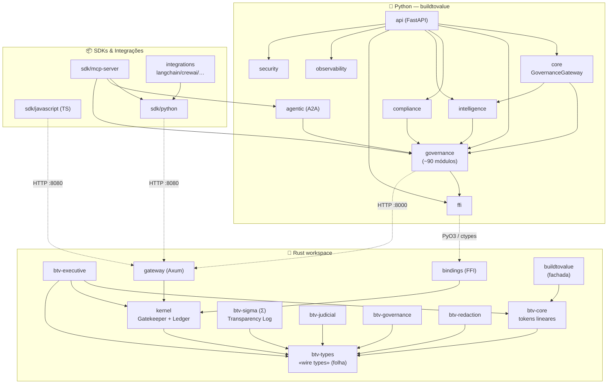
```mermaid
flowchart TB
    subgraph RUST["🦀 Rust workspace"]
        direction TB
        types["btv-types<br/>«wire types» (folha)"]
        kernel["kernel<br/>Gatekeeper + Ledger"]
        core["btv-core<br/>tokens lineares"]
        sigma["btv-sigma (Σ)<br/>Transparency Log"]
        exec["btv-executive"]
        jud["btv-judicial"]
        gov["btv-governance"]
        redact["btv-redaction"]
        gw["gateway (Axum)"]
        bind["bindings (FFI)"]
        facade["buildtovalue<br/>(fachada)"]

        kernel --> types
        core --> types
        sigma --> types
        exec --> core & kernel & types
        jud --> types
        gov --> types
        redact --> types
        gw --> kernel
        bind --> kernel
        facade --> core
    end

    subgraph PY["🐍 Python — buildtovalue"]
        direction TB
        py_api["api (FastAPI)"]
        py_core["core<br/>GovernanceGateway"]
        py_gov["governance<br/>(~90 módulos)"]
        py_comp["compliance"]
        py_intel["intelligence"]
        py_agentic["agentic (A2A)"]
        py_ffi["ffi"]
        py_obs["observability"]
        py_sec["security"]

        py_api --> py_core & py_gov & py_comp & py_intel & py_ffi & py_obs & py_sec
        py_core --> py_gov & py_intel
        py_agentic --> py_gov
        py_comp --> py_gov
        py_intel --> py_gov
        py_gov --> py_ffi
    end

    subgraph SDK["📦 SDKs & Integrações"]
        ts["sdk/javascript (TS)"]
        pysdk["sdk/python"]
        mcp["sdk/mcp-server"]
        integ["integrations<br/>langchain/crewai/…"]
        mcp --> pysdk & py_agentic & py_gov
        integ --> pysdk
    end

    py_ffi -.->|PyO3 / ctypes| bind
    py_gov -.->|HTTP :8000| gw
    ts -.->|HTTP :8080| gw
    pysdk -.->|HTTP :8080| gw
```

**Notas de design:**
- `btv-types` é a **folha** do grafo Rust: permite que `btv-judicial` verifique vereditos **sem importar** `btv-core`/`kernel` — isolamento imposto por CI (`crate_release_audit.yml`).
- O acoplamento Python é predominantemente **em direção a `governance`**, que concentra a lógica de domínio. `ffi` isola a fronteira nativa.
- **Ponto de atenção:** o pacote Python `governance` (~90 módulos) é um "pacote-deus" — candidato número 1 a subdivisão (ver §9).

---

## 4 · Diagrama de Componentes

**Objetivo:** mapear componentes de runtime, suas interfaces de comunicação e dependências.

**Escopo:** os processos/serviços em execução e os protocolos entre eles (HTTP, gRPC, FFI, MCP, arquivos).

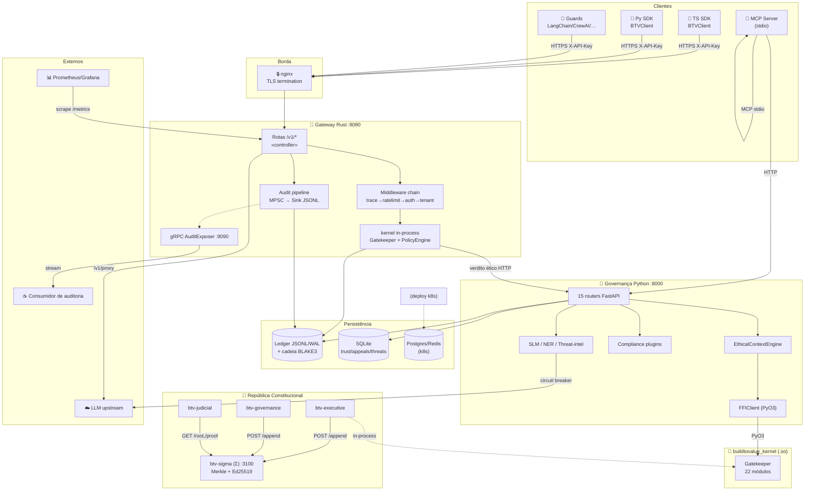
```mermaid
flowchart TB
    subgraph clients["Clientes"]
        tssdk["📘 TS SDK<br/>BTVClient"]
        pysdk["🐍 Py SDK<br/>BTVClient"]
        mcpc["🔌 MCP Server<br/>(stdio)"]
        fw["🧩 Guards<br/>LangChain/CrewAI/…"]
    end

    subgraph edge["Borda"]
        nginx["🔒 nginx<br/>TLS termination"]
    end

    subgraph gateway["🦀 Gateway Rust :8080"]
        gwroutes["Rotas /v1/*<br/>«controller»"]
        gwmw["Middleware chain<br/>trace→ratelimit→auth→tenant"]
        gkernel["kernel in-process<br/>Gatekeeper + PolicyEngine"]
        audit["Audit pipeline<br/>MPSC → Sink JSONL"]
        grpc["gRPC AuditExposer :9090"]
    end

    subgraph pygov["🐍 Governança Python :8000"]
        pyroutes["15 routers FastAPI"]
        ece["EthicalContextEngine"]
        comp["Compliance plugins"]
        intel["SLM / NER / Threat-intel"]
        pyffi["FFIClient (PyO3)"]
    end

    subgraph rustkernel["🦀 buildtovalue_kernel (.so)"]
        gkpipe["Gatekeeper<br/>22 módulos"]
    end

    subgraph republic["🦀 República Constitucional"]
        exec["btv-executive"]
        sigma["btv-sigma (Σ) :3100<br/>Merkle + Ed25519"]
        jud["btv-judicial"]
        gov["btv-governance"]
    end

    subgraph data["Persistência"]
        ledgerf[("Ledger JSONL/WAL<br/>+ cadeia BLAKE3")]
        sqlite[("SQLite<br/>trust/appeals/threats")]
        pg[("Postgres/Redis<br/>(k8s)")]
    end

    subgraph ext["Externos"]
        llm["☁️ LLM upstream"]
        prom["📊 Prometheus/Grafana"]
        javacons["☕ Consumidor de auditoria"]
    end

    tssdk & pysdk & fw -->|HTTPS X-API-Key| nginx
    nginx --> gwroutes
    mcpc -->|MCP stdio| mcpc
    mcpc -->|HTTP| pyroutes
    gwroutes --> gwmw --> gkernel
    gkernel -->|verdito ético HTTP| pyroutes
    gwroutes -->|/v1/proxy| llm
    gkernel --> ledgerf
    gwroutes --> audit --> ledgerf
    grpc -->|stream| javacons
    audit -.-> grpc
    pyroutes --> ece & comp & intel
    ece --> pyffi
    pyffi -->|PyO3| gkpipe
    pyroutes --> sqlite
    pyroutes --> ledgerf
    intel -->|circuit breaker| llm
    exec -->|POST /append| sigma
    gov -->|POST /append| sigma
    jud -->|GET /root,/proof| sigma
    exec -.->|in-process| gkpipe
    prom -->|scrape /metrics| gwroutes
    pgctx["(deploy k8s)"] -.-> pg
```

**Interfaces de comunicação (resumo):**

| Origem → Destino | Interface | Porta |
|---|---|---|
| Clientes → Gateway | REST/JSON `X-API-Key` | 8080 (nginx 8443) |
| Gateway → Governança | REST `/v1/decide` | 8000 |
| Gateway → LLM | REST proxy | externo |
| Governança → Kernel | FFI PyO3 | in-process |
| Executivo/Gov → Σ | REST `/append` | 3100 |
| Judiciário → Σ | REST `/root`,`/proof` | 3100 |
| Gateway → Auditoria | gRPC stream | 9090 |
| Prometheus → Gateway | scrape `/metrics` | 8080 |

**Notas de design:**
- O gateway acumula três papéis (segurança de borda, motor de scan, proxy) — é o ponto de maior **fan-in** e um SPOF operacional; a mitigação atual é ser stateless por tenant + `TenantStorageRouter`.
- A **auditoria é desacoplada** por um canal MPSC com *drop-on-full* (métrica `btv_audit_events_dropped_total`) — decisão consciente de disponibilidade sobre completude de telemetria (a evidência canônica vai ao ledger síncrono, não ao canal de auditoria).
- Há **dois caminhos** para o kernel: FFI (Python) e link direto (gateway/executivo). Ambos convergem no mesmo `Gatekeeper::scan_for_evidence`.

---

## 5 · Diagramas de Classes

Divididos por camada para legibilidade. Nomes preservados exatamente como no código; arquivos-fonte indicados.

### 5.1 · Rust — Kernel (pipeline de evidência)

**Objetivo:** o núcleo de scan — `Gatekeeper` executando módulos sobre um `ScanContext` para produzir `TechnicalEvidence`.

**Escopo:** `rust/kernel/src/{gatekeeper,core,evidence,interceptor,deobfuscator}.rs`.

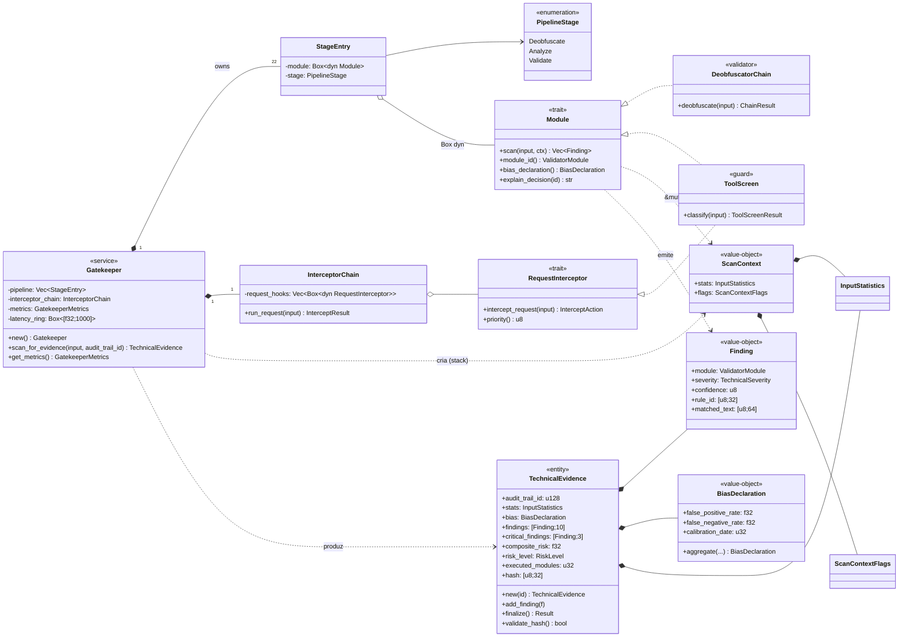
```mermaid
classDiagram
    direction LR
    class Gatekeeper {
        <<service>>
        -pipeline: Vec~StageEntry~
        -interceptor_chain: InterceptorChain
        -metrics: GatekeeperMetrics
        -latency_ring: Box~[f32;1000]~
        +new() Gatekeeper
        +scan_for_evidence(input, audit_trail_id) TechnicalEvidence
        +get_metrics() GatekeeperMetrics
    }
    class StageEntry {
        -module: Box~dyn Module~
        -stage: PipelineStage
    }
    class PipelineStage {
        <<enumeration>>
        Deobfuscate
        Analyze
        Validate
    }
    class Module {
        <<trait>>
        +scan(input, ctx) Vec~Finding~
        +module_id() ValidatorModule
        +bias_declaration() BiasDeclaration
        +explain_decision(id) str
    }
    class ScanContext {
        <<value-object>>
        +stats: InputStatistics
        +flags: ScanContextFlags
    }
    class TechnicalEvidence {
        <<entity>>
        +audit_trail_id: u128
        +stats: InputStatistics
        +bias: BiasDeclaration
        +findings: [Finding;10]
        +critical_findings: [Finding;3]
        +composite_risk: f32
        +risk_level: RiskLevel
        +executed_modules: u32
        +hash: [u8;32]
        +new(id) TechnicalEvidence
        +add_finding(f)
        +finalize() Result
        +validate_hash() bool
    }
    class Finding {
        <<value-object>>
        +module: ValidatorModule
        +severity: TechnicalSeverity
        +confidence: u8
        +rule_id: [u8;32]
        +matched_text: [u8;64]
    }
    class BiasDeclaration {
        <<value-object>>
        +false_positive_rate: f32
        +false_negative_rate: f32
        +calibration_date: u32
        +aggregate(...) BiasDeclaration
    }
    class InterceptorChain {
        -request_hooks: Vec~Box~dyn RequestInterceptor~~
        +run_request(input) InterceptResult
    }
    class RequestInterceptor {
        <<trait>>
        +intercept_request(input) InterceptAction
        +priority() u8
    }
    class ToolScreen {
        <<guard>>
        +classify(input) ToolScreenResult
    }
    class DeobfuscatorChain {
        <<validator>>
        +deobfuscate(input) ChainResult
    }

    Gatekeeper "1" *-- "22" StageEntry : owns
    Gatekeeper "1" *-- "1" InterceptorChain
    StageEntry --> PipelineStage
    StageEntry o-- Module : Box dyn
    Module <|.. DeobfuscatorChain
    Module <|.. ToolScreen
    RequestInterceptor <|.. ToolScreen
    InterceptorChain o-- RequestInterceptor
    Gatekeeper ..> ScanContext : cria (stack)
    Gatekeeper ..> TechnicalEvidence : produz
    Module ..> ScanContext : &mut
    Module ..> Finding : emite
    TechnicalEvidence *-- Finding
    TechnicalEvidence *-- BiasDeclaration
    TechnicalEvidence *-- InputStatistics
    ScanContext *-- InputStatistics
    ScanContext *-- ScanContextFlags
```

**Notas de design:**
- **Padrão Strategy + Pipeline:** módulos concretos (`CpfValidator`, `PromptInjectionDetector`, `Base64Detector`, …) implementam o trait `Module` e são boxados numa `Vec<StageEntry>` executada em ordem fixa `Deobfuscate → Analyze → Validate`.
- **Zero-heap no hot path:** `ScanContext`/`TechnicalEvidence` são `#[repr(C, align(8))]` de tamanho fixo (9632 bytes), alocados na stack; `executed_modules` é um bitmask (ADR-017).
- **Fail-secure por construção:** `TechnicalEvidence::new` nasce com `hash = [0u8;32]` (inválido); só `finalize()` sela o BLAKE3. `#[must_use]` faz o descarte virar erro de build sob `#![deny(warnings)]`.
- `DeobfuscatorChain` é ao mesmo tempo um `Module` (estágio) e é reexecutado no **Stage 3.5** para re-escanear conteúdo decodificado (defesa contra evasão em camadas).

### 5.2 · Rust — Ledger imutável

**Objetivo:** persistência append-only com encadeamento de hash, Merkle e HMAC por registro.

**Escopo:** `rust/kernel/src/ledger/*.rs`.

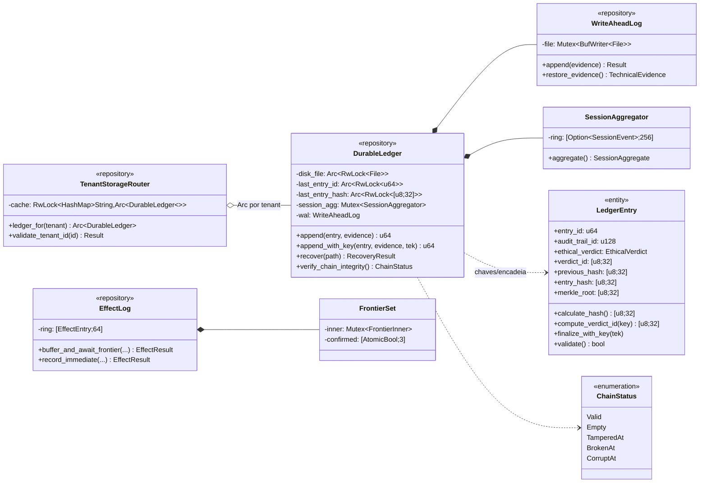
```mermaid
classDiagram
    direction LR
    class DurableLedger {
        <<repository>>
        -disk_file: Arc~RwLock~File~~
        -last_entry_id: Arc~RwLock~u64~~
        -last_entry_hash: Arc~RwLock~[u8;32]~~
        -session_agg: Mutex~SessionAggregator~
        -wal: WriteAheadLog
        +append(entry, evidence) u64
        +append_with_key(entry, evidence, tek) u64
        +recover(path) RecoveryResult
        +verify_chain_integrity() ChainStatus
    }
    class LedgerEntry {
        <<entity>>
        +entry_id: u64
        +audit_trail_id: u128
        +ethical_verdict: EthicalVerdict
        +verdict_id: [u8;32]
        +previous_hash: [u8;32]
        +entry_hash: [u8;32]
        +merkle_root: [u8;32]
        +calculate_hash() [u8;32]
        +compute_verdict_id(key) [u8;32]
        +finalize_with_key(tek)
        +validate() bool
    }
    class WriteAheadLog {
        <<repository>>
        -file: Mutex~BufWriter~File~~
        +append(evidence) Result
        +restore_evidence() TechnicalEvidence
    }
    class EffectLog {
        <<repository>>
        -ring: [EffectEntry;64]
        +buffer_and_await_frontier(...) EffectResult
        +record_immediate(...) EffectResult
    }
    class FrontierSet {
        -inner: Mutex~FrontierInner~
        -confirmed: [AtomicBool;3]
    }
    class SessionAggregator {
        -ring: [Option~SessionEvent~;256]
        +aggregate() SessionAggregate
    }
    class TenantStorageRouter {
        <<repository>>
        -cache: RwLock~HashMap~String,Arc~DurableLedger~~~
        +ledger_for(tenant) Arc~DurableLedger~
        +validate_tenant_id(id) Result
    }
    class ChainStatus {
        <<enumeration>>
        Valid
        Empty
        TamperedAt
        BrokenAt
        CorruptAt
    }

    DurableLedger *-- WriteAheadLog
    DurableLedger *-- SessionAggregator
    DurableLedger ..> LedgerEntry : chaves/encadeia
    DurableLedger ..> ChainStatus
    EffectLog *-- FrontierSet
    TenantStorageRouter o-- DurableLedger : Arc por tenant
```

**Notas de design:**
- **Cadeia de integridade tripla:** `entry_hash = BLAKE3(id ‖ trail ‖ ts ‖ previous_hash ‖ reserved)`; `merkle_root = BLAKE3(prev_merkle ‖ entry_hash)`; `verdict_id = HMAC-SHA256(TEK, ...)`. Adulterar qualquer registro quebra a verificação (`ChainStatus::TamperedAt`).
- **WAL-first:** grava o snapshot da evidência no WAL (fsync) *antes* de escrever a entrada em disco — garante recuperação após crash (`recover()` com SLA < 5 s).
- **Isolamento multi-tenant** (ADR-0083): `TenantStorageRouter` mantém um `DurableLedger` por tenant em `RwLock<HashMap<..., Arc<...>>>`, com `validate_tenant_id` barrando path-traversal.
- **Ownership:** o uso de `Arc<RwLock<...>>` protege a cabeça da cadeia (id/hash) compartilhada entre handlers concorrentes; `EffectLog` combina `Mutex` (escrita) com `[AtomicBool;3]` lock-free (confirmação de fronteira).

### 5.3 · Rust — República Constitucional (tipos lineares)

**Objetivo:** modelar a "Algorithmic Republic" ⟨L, E, J, Σ⟩ e a **linearidade de tipos** que torna impossível emitir um veredito sem consumir exatamente uma evidência + um token de conformidade.

**Escopo:** `rust/btv-core`, `btv-executive`, `btv-judicial`, `btv-governance`, `btv-sigma`, `btv-redaction`.

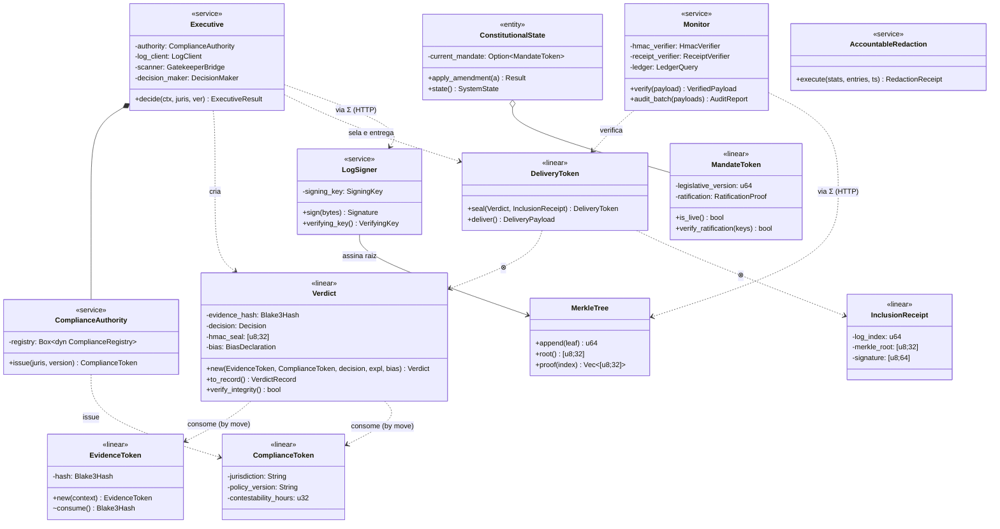
```mermaid
classDiagram
    direction TB
    class EvidenceToken {
        <<linear>>
        -hash: Blake3Hash
        +new(context) EvidenceToken
        ~consume() Blake3Hash
    }
    class ComplianceToken {
        <<linear>>
        -jurisdiction: String
        -policy_version: String
        -contestability_hours: u32
    }
    class ComplianceAuthority {
        <<service>>
        -registry: Box~dyn ComplianceRegistry~
        +issue(juris, version) ComplianceToken
    }
    class Verdict {
        <<linear>>
        -evidence_hash: Blake3Hash
        -decision: Decision
        -hmac_seal: [u8;32]
        -bias: BiasDeclaration
        +new(EvidenceToken, ComplianceToken, decision, expl, bias) Verdict
        +to_record() VerdictRecord
        +verify_integrity() bool
    }
    class InclusionReceipt {
        <<linear>>
        -log_index: u64
        -merkle_root: [u8;32]
        -signature: [u8;64]
    }
    class DeliveryToken {
        <<linear>>
        +seal(Verdict, InclusionReceipt) DeliveryToken
        +deliver() DeliveryPayload
    }

    class Executive {
        <<service>>
        -authority: ComplianceAuthority
        -log_client: LogClient
        -scanner: GatekeeperBridge
        -decision_maker: DecisionMaker
        +decide(ctx, juris, ver) ExecutiveResult
    }
    class Monitor {
        <<service>>
        -hmac_verifier: HmacVerifier
        -receipt_verifier: ReceiptVerifier
        -ledger: LedgerQuery
        +verify(payload) VerifiedPayload
        +audit_batch(payloads) AuditReport
    }
    class LogSigner {
        <<service>>
        -signing_key: SigningKey
        +sign(bytes) Signature
        +verifying_key() VerifyingKey
    }
    class MerkleTree {
        +append(leaf) u64
        +root() [u8;32]
        +proof(index) Vec~[u8;32]~
    }
    class MandateToken {
        <<linear>>
        -legislative_version: u64
        -ratification: RatificationProof
        +is_live() bool
        +verify_ratification(keys) bool
    }
    class ConstitutionalState {
        <<entity>>
        -current_mandate: Option~MandateToken~
        +apply_amendment(a) Result
        +state() SystemState
    }
    class AccountableRedaction {
        <<service>>
        +execute(stats, entries, ts) RedactionReceipt
    }

    ComplianceAuthority ..> ComplianceToken : issue
    Verdict ..> EvidenceToken : consome (by move)
    Verdict ..> ComplianceToken : consome (by move)
    DeliveryToken ..> Verdict : ⊗
    DeliveryToken ..> InclusionReceipt : ⊗
    Executive *-- ComplianceAuthority
    Executive ..> Verdict : cria
    Executive ..> DeliveryToken : sela e entrega
    Monitor ..> DeliveryToken : verifica
    LogSigner --> MerkleTree : assina raiz
    ConstitutionalState o-- MandateToken
    Executive ..> LogSigner : via Σ (HTTP)
    Monitor ..> MerkleTree : via Σ (HTTP)
```

**Notas de design:**
- **Tipos lineares como capabilities:** `EvidenceToken`, `ComplianceToken`, `Verdict`, `InclusionReceipt`, `DeliveryToken` e `MandateToken` **não derivam `Clone`/`Copy`**, têm campos privados e construtores `pub(crate)`, e são `#[must_use]`. Isso codifica no sistema de tipos a regra "⊗-I": um `Verdict` **consome por movimento** exatamente um `EvidenceToken` e um `ComplianceToken`; entregar sem prova de inclusão é impossível de compilar.
- **Separação de poderes real:** `btv-judicial` depende **apenas** de `btv-types` — verifica o trabalho do Executivo sem confiar em nem importar seu código (Thm 3.4). `btv-governance` nunca importa `btv-executive`. Invariantes checadas em CI.
- **Σ (btv-sigma)** é a única autoridade de log; os três poderes comunicam-se **através** dela por HTTP, nunca diretamente.
- `AccountableRedaction` implementa apagamento (LGPD Art. 18) preservando prova de que estatísticas de grupo não mudaram além de ε (Stone Clause SC-004) — atualmente em "modo direto" com stubs ZK.
- **Colisões de nomes a atenção:** existem **três** `TechnicalEvidence` (kernel 9632 B, btv-types 9596 B) e dois `Decision`/`BiasDeclaration`. Os diagramas mantêm o crate de origem para desambiguar.

### 5.4 · Fronteira FFI Python ↔ Rust

**Objetivo:** o contrato exato entre a governança Python e o kernel Rust.

**Escopo:** `rust/bindings`, `rust/kernel/src/ffi`, `python/buildtovalue/ffi`, `governance/ffi_client.py`.

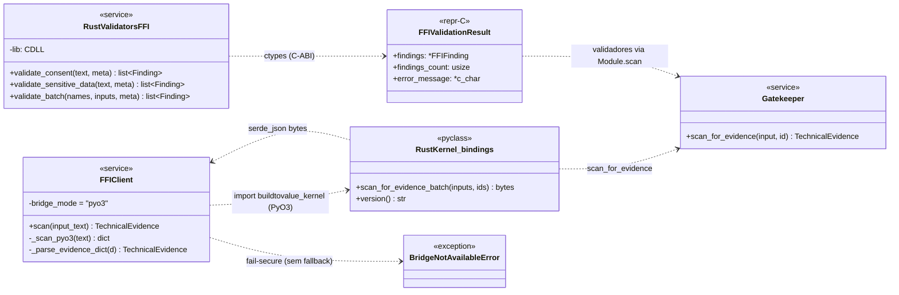
```mermaid
classDiagram
    direction LR
    class FFIClient {
        <<service>>
        -bridge_mode = "pyo3"
        +scan(input_text) TechnicalEvidence
        -_scan_pyo3(text) dict
        -_parse_evidence_dict(d) TechnicalEvidence
    }
    class RustValidatorsFFI {
        <<service>>
        -lib: CDLL
        +validate_consent(text, meta) list~Finding~
        +validate_sensitive_data(text, meta) list~Finding~
        +validate_batch(names, inputs, meta) list~Finding~
    }
    class RustKernel_bindings {
        <<pyclass>>
        +scan_for_evidence_batch(inputs, ids) bytes
        +version() str
    }
    class Gatekeeper {
        <<service>>
        +scan_for_evidence(input, id) TechnicalEvidence
    }
    class FFIValidationResult {
        <<repr-C>>
        +findings: *FFIFinding
        +findings_count: usize
        +error_message: *c_char
    }
    class BridgeNotAvailableError {
        <<exception>>
    }

    FFIClient ..> RustKernel_bindings : import buildtovalue_kernel (PyO3)
    RustKernel_bindings ..> Gatekeeper : scan_for_evidence
    RustKernel_bindings ..> FFIClient : serde_json bytes
    RustValidatorsFFI ..> FFIValidationResult : ctypes (C-ABI)
    FFIValidationResult ..> Gatekeeper : validadores via Module.scan
    FFIClient ..> BridgeNotAvailableError : fail-secure (sem fallback)
```

**Notas de design:**
- **Dois mecanismos coexistem:** (1) **PyO3** — módulo nativo `buildtovalue_kernel`, usado por `FFIClient`, passando JSON (`serde_json`) via `scan_for_evidence_batch`; (2) **C-ABI/ctypes** — `libbuildtovalue_kernel.so` com structs `#[repr(C)]`, usado por `RustValidatorsFFI` para validadores de consentimento.
- **Fail-secure sem degradação:** `FFIClient` é PyO3-only; se o módulo nativo não importar, levanta `BridgeNotAvailableError` — um módulo de segurança **não** deve cair silenciosamente para um fallback Python.
- **Ponto de atenção (dívida técnica):** existem **duas** definições de `#[pymodule] buildtovalue_kernel` (em `bindings` e em `kernel/ffi/bridge`) com APIs de `RustKernel` divergentes. `ffi_client.py` usa a variante `bindings`. Consolidar é uma refatoração de baixo risco e alto valor (ver §9).

### 5.5 · Python — Camada de Governança (Ethical Context Engine)

**Objetivo:** o orquestrador de decisão ética e suas camadas Técnica/Governança.

**Escopo:** `python/buildtovalue/governance/` + `core/governance_gateway.py` (subconjunto arquiteturalmente significativo).

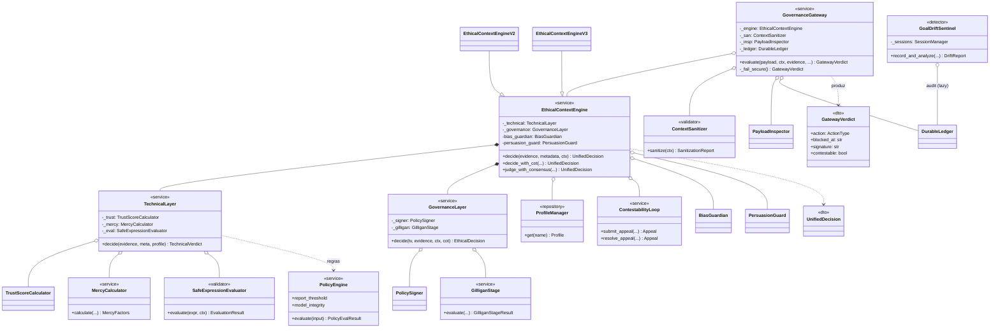
```mermaid
classDiagram
    direction TB
    class GovernanceGateway {
        <<service>>
        -_engine: EthicalContextEngine
        -_san: ContextSanitizer
        -_insp: PayloadInspector
        -_ledger: DurableLedger
        +evaluate(payload, ctx, evidence, ...) GatewayVerdict
        -_fail_secure() GatewayVerdict
    }
    class EthicalContextEngine {
        <<service>>
        -_technical: TechnicalLayer
        -_governance: GovernanceLayer
        -bias_guardian: BiasGuardian
        -persuasion_guard: PersuasionGuard
        +decide(evidence, metadata, ctx) UnifiedDecision
        +decide_with_cot(...) UnifiedDecision
        +judge_with_consensus(...) UnifiedDecision
    }
    class TechnicalLayer {
        <<service>>
        -_trust: TrustScoreCalculator
        -_mercy: MercyCalculator
        -_eval: SafeExpressionEvaluator
        +decide(evidence, meta, profile) TechnicalVerdict
    }
    class GovernanceLayer {
        <<service>>
        -_signer: PolicySigner
        -_gilligan: GilliganStage
        +decide(tv, evidence, ctx, cot) EthicalDecision
    }
    class PolicyEngine {
        <<service>>
        +evaluate(input) PolicyEvalResult
        +report_threshold
        +model_integrity
    }
    class SafeExpressionEvaluator {
        <<validator>>
        +evaluate(expr, ctx) EvaluationResult
    }
    class MercyCalculator {
        <<service>>
        +calculate(...) MercyFactors
    }
    class GilliganStage {
        <<service>>
        +evaluate(...) GilliganStageResult
    }
    class ContestabilityLoop {
        <<service>>
        +submit_appeal(...) Appeal
        +resolve_appeal(...) Appeal
    }
    class ProfileManager {
        <<repository>>
        +get(name) Profile
    }
    class ContextSanitizer {
        <<validator>>
        +sanitize(ctx) SanitizationReport
    }
    class GoalDriftSentinel {
        <<detector>>
        -_sessions: SessionManager
        +record_and_analyze(...) DriftReport
    }
    class GatewayVerdict {
        <<dto>>
        +action: ActionType
        +blocked_at: str
        +signature: str
        +contestable: bool
    }
    class UnifiedDecision {
        <<dto>>
    }

    GovernanceGateway o-- EthicalContextEngine
    GovernanceGateway o-- ContextSanitizer
    GovernanceGateway o-- PayloadInspector
    GovernanceGateway o-- DurableLedger
    GovernanceGateway ..> GatewayVerdict : produz
    EthicalContextEngine *-- TechnicalLayer
    EthicalContextEngine *-- GovernanceLayer
    EthicalContextEngine o-- ProfileManager
    EthicalContextEngine o-- ContestabilityLoop
    EthicalContextEngine o-- BiasGuardian
    EthicalContextEngine o-- PersuasionGuard
    EthicalContextEngine ..> UnifiedDecision
    TechnicalLayer o-- TrustScoreCalculator
    TechnicalLayer o-- MercyCalculator
    TechnicalLayer o-- SafeExpressionEvaluator
    GovernanceLayer o-- PolicySigner
    GovernanceLayer o-- GilliganStage
    TechnicalLayer ..> PolicyEngine : regras
    GoalDriftSentinel o-- DurableLedger : audit (lazy)
    EthicalContextEngineV2 --|> EthicalContextEngine
    EthicalContextEngineV3 --|> EthicalContextEngine
```

**Notas de design:**
- **Composição em camadas:** `EthicalContextEngine` (o motor canônico, `ethical_context_engine.py`) compõe uma `TechnicalLayer` (trust score + mercy + avaliação de regras em sandbox AST) e uma `GovernanceLayer` (assinatura de política + estágio ético "ethics of care" de Gilligan). O resultado é uma `UnifiedDecision`.
- **Filosofia ética computável:** o design incorpora quatro lentes — Rawls (equidade), Levinas (proteção do vulnerável), Jonas (responsabilidade) e Gilligan (misericórdia) — refletidas nos campos `*_rationale` do `ExplainDecision` e no `MercyCalculator` (que pode transformar `BLOCK` em `EDUCATE` na primeira ofensa).
- **`SafeExpressionEvaluator`** avalia condições de política num sandbox AST (sem `eval`), com timeout e allowlist de nós/funções — mitigação de RCE em regras declarativas.
- **Dois `EthicalContextEngine`:** o canônico unificado (`ethical_context_engine.py`, exportado no `__init__`) e um legado (`context_engine.py`) usado apenas por `GovernanceGateway`. Convergência é candidata a refatoração (ver §9).

### 5.6 · Python — API, Compliance e Intelligence

**Objetivo:** a montagem FastAPI, o padrão de plugins de compliance e a inteligência (SLM/NER/threat-intel).

**Escopo:** `api/`, `compliance/`, `intelligence/`.

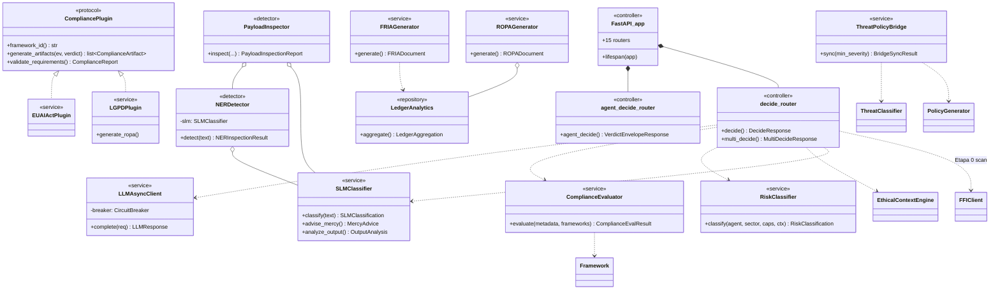
```mermaid
classDiagram
    direction TB
    class FastAPI_app {
        <<controller>>
        +lifespan(app)
        +15 routers
    }
    class decide_router {
        <<controller>>
        +decide() DecideResponse
        +multi_decide() MultiDecideResponse
    }
    class agent_decide_router {
        <<controller>>
        +agent_decide() VerdictEnvelopeResponse
    }
    class CompliancePlugin {
        <<protocol>>
        +framework_id() str
        +generate_artifacts(ev, verdict) list~ComplianceArtifact~
        +validate_requirements() ComplianceReport
    }
    class LGPDPlugin {
        <<service>>
        +generate_ropa()
    }
    class EUAIActPlugin {
        <<service>>
    }
    class ComplianceEvaluator {
        <<service>>
        +evaluate(metadata, frameworks) ComplianceEvalResult
    }
    class RiskClassifier {
        <<service>>
        +classify(agent, sector, caps, ctx) RiskClassification
    }
    class ROPAGenerator {
        <<service>>
        +generate() ROPADocument
    }
    class FRIAGenerator {
        <<service>>
        +generate() FRIADocument
    }
    class LedgerAnalytics {
        <<repository>>
        +aggregate() LedgerAggregation
    }
    class SLMClassifier {
        <<service>>
        +classify(text) SLMClassification
        +advise_mercy() MercyAdvice
        +analyze_output() OutputAnalysis
    }
    class NERDetector {
        <<detector>>
        -slm: SLMClassifier
        +detect(text) NERInspectionResult
    }
    class PayloadInspector {
        <<detector>>
        +inspect(...) PayloadInspectionReport
    }
    class LLMAsyncClient {
        <<service>>
        -breaker: CircuitBreaker
        +complete(req) LLMResponse
    }
    class ThreatPolicyBridge {
        <<service>>
        +sync(min_severity) BridgeSyncResult
    }

    FastAPI_app *-- decide_router
    FastAPI_app *-- agent_decide_router
    decide_router ..> FFIClient : Etapa 0 scan
    decide_router ..> SLMClassifier
    decide_router ..> EthicalContextEngine
    decide_router ..> RiskClassifier
    decide_router ..> ComplianceEvaluator
    CompliancePlugin <|.. LGPDPlugin
    CompliancePlugin <|.. EUAIActPlugin
    ComplianceEvaluator ..> Framework
    ROPAGenerator o-- LedgerAnalytics
    FRIAGenerator ..> LedgerAnalytics
    NERDetector o-- SLMClassifier
    PayloadInspector o-- SLMClassifier
    PayloadInspector o-- NERDetector
    ThreatPolicyBridge ..> PolicyGenerator
    ThreatPolicyBridge ..> ThreatClassifier
    decide_router ..> LLMAsyncClient
```

**Notas de design:**
- **Plugin architecture (duck-typed):** `CompliancePlugin` é um `Protocol` (structural typing); `LGPDPlugin`/`EUAIActPlugin` são registrados num dict `COMPLIANCE_PLUGINS`. Novos frameworks entram sem tocar no core.
- **Fluxo de artefatos regulatórios:** `frameworks`/`translator` (fonte) → `ComplianceEvaluator`/plugins (avaliação) → `ROPA/FRIA/Art20/AJL` generators (alimentados por `LedgerAnalytics`) → `DocumentExporter` (PDF/JSON).
- **Resiliência de LLM:** `LLMAsyncClient` embute **Circuit Breaker** (`CLOSED/OPEN/HALF_OPEN`) + retry; `LLMFallbackOrchestrator` degrada por prioridade. Isola o BTV de instabilidade do upstream.
- **Threat-intel → política:** `ThreatPolicyBridge.sync` transforma ameaças (MISP) em políticas YAML **nascidas desabilitadas** — só ativadas após revisão humana. Boa aplicação de "human-in-the-loop by default".
- **ADR-0093:** o `lifespan` injeta **todos** os singletons em `app.state` (sem globais de módulo) — melhora testabilidade e evita estado compartilhado implícito.

### 5.7 · Python — Agentic (negociação A2A)

**Objetivo:** governança de negociação agente-a-agente determinística e auditável.

**Escopo:** `python/buildtovalue/agentic/`.

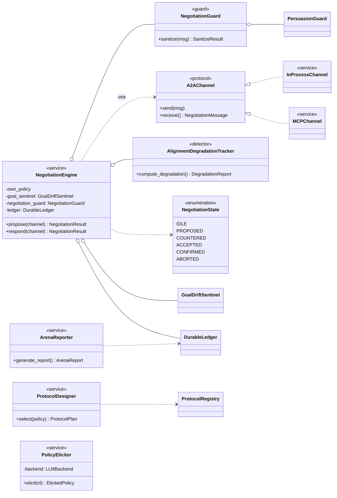
```mermaid
classDiagram
    direction LR
    class NegotiationEngine {
        <<service>>
        -own_policy
        -goal_sentinel: GoalDriftSentinel
        -negotiation_guard: NegotiationGuard
        -ledger: DurableLedger
        +propose(channel) NegotiationResult
        +respond(channel) NegotiationResult
    }
    class A2AChannel {
        <<protocol>>
        +send(msg)
        +receive() NegotiationMessage
    }
    class InProcessChannel {
        <<service>>
    }
    class MCPChannel {
        <<service>>
    }
    class NegotiationGuard {
        <<guard>>
        +sanitize(msg) SanitizeResult
    }
    class ProtocolDesigner {
        <<service>>
        +select(policy) ProtocolPlan
    }
    class AlignmentDegradationTracker {
        <<detector>>
        +compute_degradation() DegradationReport
    }
    class ArenaReporter {
        <<service>>
        +generate_report() ArenaReport
    }
    class PolicyElicitor {
        <<service>>
        -backend: LLMBackend
        +elicit(nl) ElicitedPolicy
    }
    class NegotiationState {
        <<enumeration>>
        IDLE
        PROPOSED
        COUNTERED
        ACCEPTED
        CONFIRMED
        ABORTED
    }

    A2AChannel <|.. InProcessChannel
    A2AChannel <|.. MCPChannel
    NegotiationEngine o-- NegotiationGuard
    NegotiationEngine o-- GoalDriftSentinel
    NegotiationEngine o-- DurableLedger
    NegotiationEngine o-- AlignmentDegradationTracker
    NegotiationEngine ..> A2AChannel : usa
    NegotiationEngine ..> NegotiationState
    NegotiationGuard o-- PersuasionGuard
    ProtocolDesigner ..> ProtocolRegistry
    ArenaReporter ..> DurableLedger
```

**Notas de design:**
- **Determinismo por design:** o `NegotiationEngine` é uma máquina de estados **sem LLM no loop** — cada mensagem e transição é assinada por HMAC e registrada no `DurableLedger`, tornando a negociação reproduzível e auditável.
- **Defesa em profundidade:** toda mensagem entrante passa pelo `NegotiationGuard` (checagem de injeção YAML + `PersuasionGuard` + deobfuscação FFI opcional) antes do engine — fail-secure (`allowed=False` em exceção).
- `ProtocolDesigner` casa requisitos de política a protocolos registrados (`commit_reveal`, `hmac_evidence`, `bft_consensus`, `zk_proof`, `mpc_computation`, …) — separação limpa entre seleção e execução.

### 5.8 · TypeScript / Python SDK

**Objetivo:** as bibliotecas cliente do gateway. TS é a única superfície de front-end.

**Escopo:** `sdk/javascript/src`, `sdk/python/buildtovalue`.

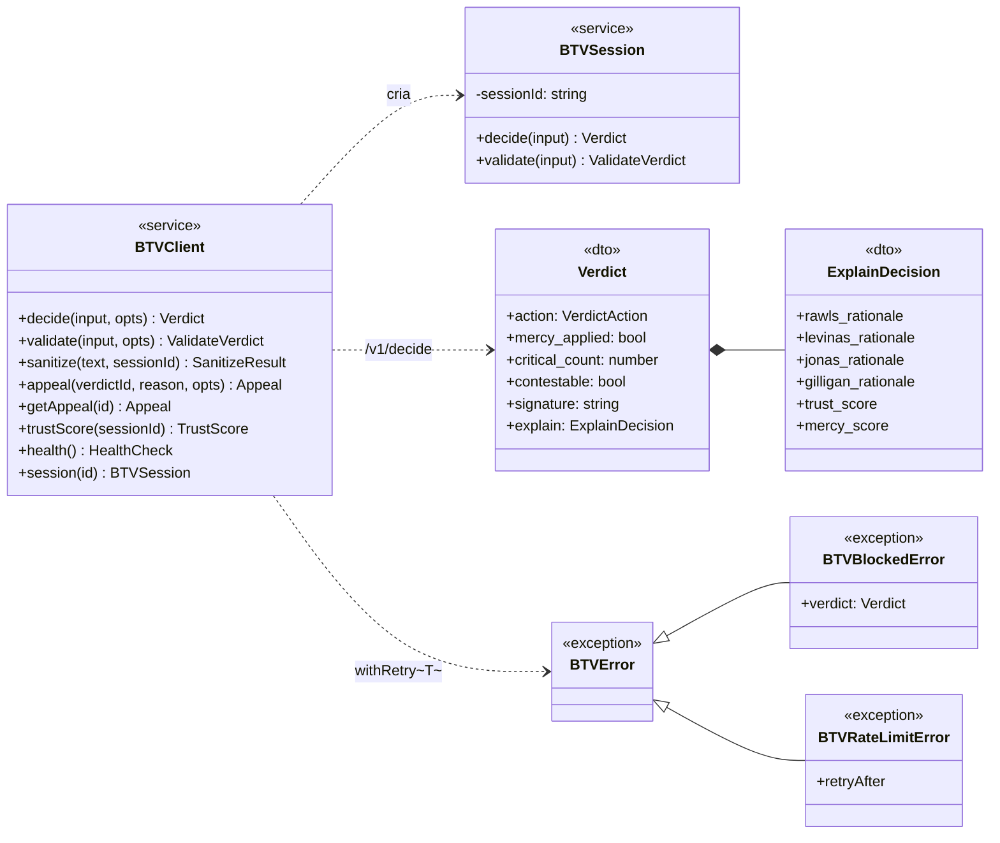
```mermaid
classDiagram
    direction LR
    class BTVClient {
        <<service>>
        +decide(input, opts) Verdict
        +validate(input, opts) ValidateVerdict
        +sanitize(text, sessionId) SanitizeResult
        +appeal(verdictId, reason, opts) Appeal
        +getAppeal(id) Appeal
        +trustScore(sessionId) TrustScore
        +health() HealthCheck
        +session(id) BTVSession
    }
    class BTVSession {
        <<service>>
        -sessionId: string
        +decide(input) Verdict
        +validate(input) ValidateVerdict
    }
    class Verdict {
        <<dto>>
        +action: VerdictAction
        +mercy_applied: bool
        +critical_count: number
        +contestable: bool
        +signature: string
        +explain: ExplainDecision
    }
    class ExplainDecision {
        <<dto>>
        +rawls_rationale
        +levinas_rationale
        +jonas_rationale
        +gilligan_rationale
        +trust_score
        +mercy_score
    }
    class BTVError {
        <<exception>>
    }
    class BTVBlockedError {
        <<exception>>
        +verdict: Verdict
    }
    class BTVRateLimitError {
        <<exception>>
        +retryAfter
    }

    BTVClient ..> BTVSession : cria
    BTVClient ..> Verdict : /v1/decide
    Verdict *-- ExplainDecision
    BTVError <|-- BTVBlockedError
    BTVError <|-- BTVRateLimitError
    BTVClient ..> BTVError : withRetry~T~
```

**Notas de design:**
- **Paridade TS/Python:** ambos os SDKs expõem a mesma API (`decide/validate/sanitize/appeal/trustScore/health/session`), o mesmo mapa de endpoints e a mesma hierarquia de erros (`BTVError` → `BTVBlockedError`/`BTVRateLimitError`/`BTVGatewayError`/…), com retry exponencial (2/4/8 s) para `{429,500,502,503,504}`.
- **Sem dependências de runtime no TS** — usa `fetch`/`AbortController`/`crypto.randomUUID` nativos; portável para Node/Deno/Bun.
- O objeto `ExplainDecision` carrega as quatro racionalidades filosóficas de volta ao cliente — a explicabilidade é parte do contrato, não um extra.

---

## 6 · Diagramas de Sequência

### 6.1 · `POST /v1/decide` via Gateway

**Objetivo:** o fluxo de negócio principal — uma decisão de governança de ponta a ponta.

**Escopo:** SDK → Gateway Rust → kernel in-process → API Python → resposta assinada.

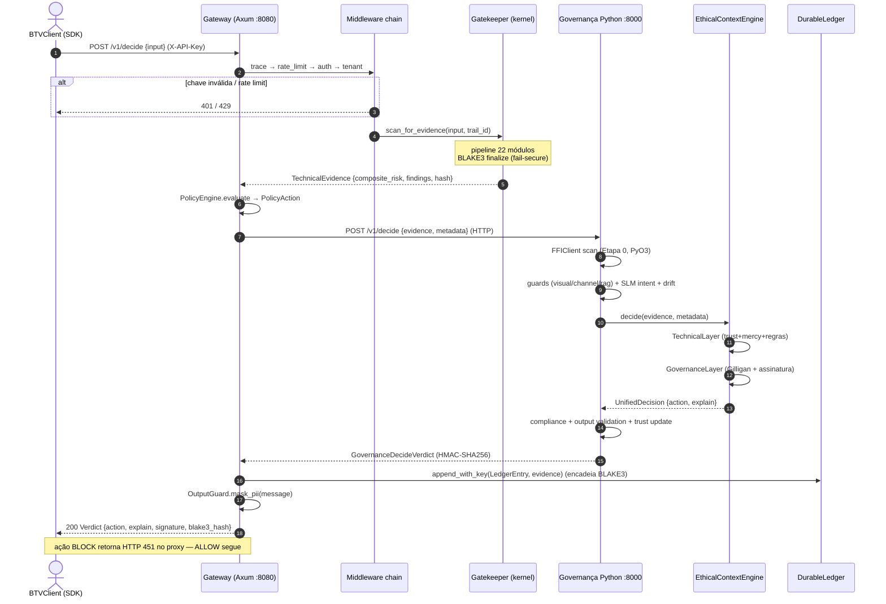
```mermaid
sequenceDiagram
    autonumber
    actor SDK as BTVClient (SDK)
    participant GW as Gateway (Axum :8080)
    participant MW as Middleware chain
    participant GK as Gatekeeper (kernel)
    participant PY as Governança Python :8000
    participant ECE as EthicalContextEngine
    participant LG as DurableLedger

    SDK->>GW: POST /v1/decide {input}  (X-API-Key)
    GW->>MW: trace → rate_limit → auth → tenant
    alt chave inválida / rate limit
        MW-->>SDK: 401 / 429
    end
    MW->>GK: scan_for_evidence(input, trail_id)
    Note over GK: pipeline 22 módulos<br/>BLAKE3 finalize (fail-secure)
    GK-->>GW: TechnicalEvidence {composite_risk, findings, hash}
    GW->>GW: PolicyEngine.evaluate → PolicyAction
    GW->>PY: POST /v1/decide {evidence, metadata}  (HTTP)
    PY->>PY: FFIClient scan (Etapa 0, PyO3)
    PY->>PY: guards (visual/channel/rag) + SLM intent + drift
    PY->>ECE: decide(evidence, metadata)
    ECE->>ECE: TechnicalLayer (trust+mercy+regras)
    ECE->>ECE: GovernanceLayer (Gilligan + assinatura)
    ECE-->>PY: UnifiedDecision {action, explain}
    PY->>PY: compliance + output validation + trust update
    PY-->>GW: GovernanceDecideVerdict (HMAC-SHA256)
    GW->>LG: append_with_key(LedgerEntry, evidence)  (encadeia BLAKE3)
    GW->>GW: OutputGuard.mask_pii(message)
    GW-->>SDK: 200 Verdict {action, explain, signature, blake3_hash}
    Note over SDK,GW: ação BLOCK retorna HTTP 451 no proxy — ALLOW segue
```

**Notas de design:**
- O gateway espelha internamente a metáfora constitucional em comentários (**EXECUTIVO** = scan/policy no kernel, **JUDICIÁRIO** = chamada à governança Python, **AUDITIVO** = ledger), mas este é o **caminho sidecar** — distinto do triângulo pura-Rust (§6.3).
- Chamadas **síncronas** dominam; a auditoria adicional (evento de fairness) é emitida **assincronamente** por um canal MPSC (não mostrado, para clareza).
- Fail-secure em toda etapa: exceção ou `503` de singleton → BLOCK assinado.

### 6.2 · Scan FFI Python → Rust Kernel

**Objetivo:** detalhar a travessia da fronteira nativa (o caminho independente do gateway).

**Escopo:** `FFIClient.scan` → PyO3 → `Gatekeeper`.

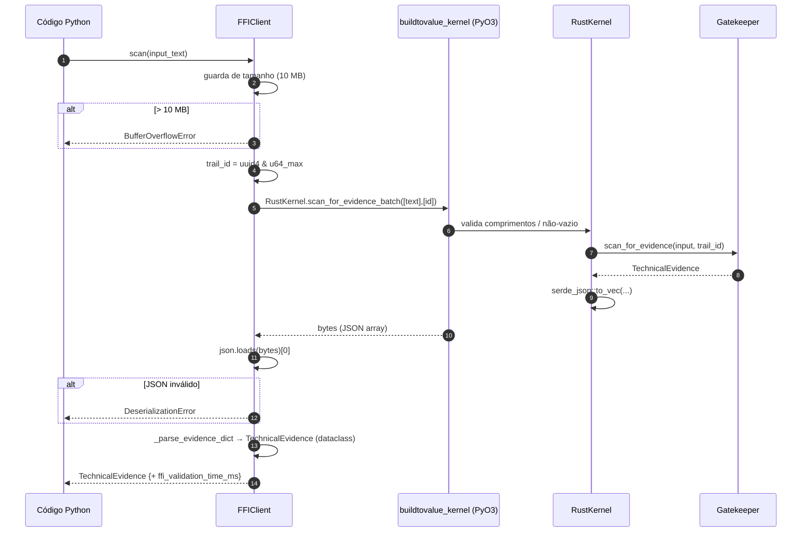
```mermaid
sequenceDiagram
    autonumber
    participant PY as Código Python
    participant FC as FFIClient
    participant NM as buildtovalue_kernel (PyO3)
    participant RK as RustKernel
    participant GK as Gatekeeper

    PY->>FC: scan(input_text)
    FC->>FC: guarda de tamanho (10 MB)
    alt > 10 MB
        FC-->>PY: BufferOverflowError
    end
    FC->>FC: trail_id = uuid4 & u64_max
    FC->>NM: RustKernel.scan_for_evidence_batch([text],[id])
    NM->>RK: valida comprimentos / não-vazio
    RK->>GK: scan_for_evidence(input, trail_id)
    GK-->>RK: TechnicalEvidence
    RK->>RK: serde_json::to_vec(...)
    NM-->>FC: bytes (JSON array)
    FC->>FC: json.loads(bytes)[0]
    alt JSON inválido
        FC-->>PY: DeserializationError
    end
    FC->>FC: _parse_evidence_dict → TechnicalEvidence (dataclass)
    FC-->>PY: TechnicalEvidence {+ ffi_validation_time_ms}
```

**Notas de design:**
- Mesmo um scan único trafega pela **entrada em lote** (`scan_for_evidence_batch`) — simplifica o contrato a uma única função de fronteira.
- **Sem fallback:** ImportError do módulo nativo ⇒ `BridgeNotAvailableError` (fail-secure).

### 6.3 · República Constitucional: Executivo → Σ → Judiciário

**Objetivo:** o não-repúdio matemático — decisão, inclusão no log transparente e verificação **independente**.

**Escopo:** `btv-executive`, `btv-sigma`, `btv-judicial`.

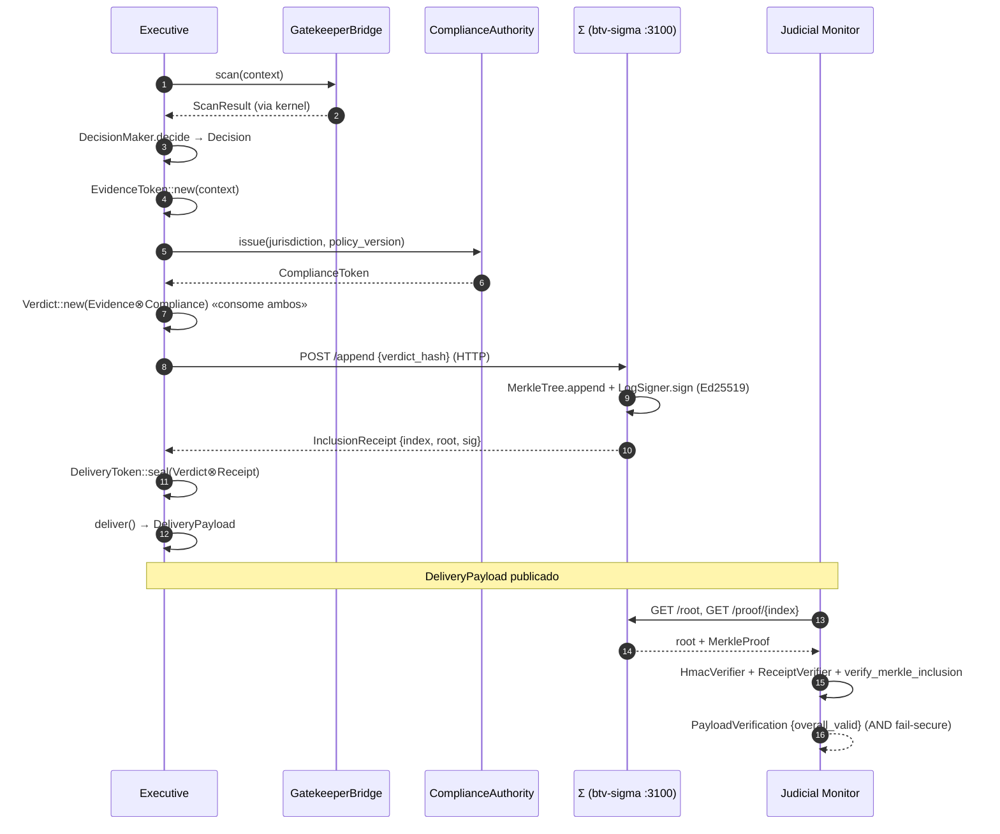
```mermaid
sequenceDiagram
    autonumber
    participant E as Executive
    participant GB as GatekeeperBridge
    participant CA as ComplianceAuthority
    participant SIG as Σ (btv-sigma :3100)
    participant J as Judicial Monitor

    E->>GB: scan(context)
    GB-->>E: ScanResult (via kernel)
    E->>E: DecisionMaker.decide → Decision
    E->>E: EvidenceToken::new(context)
    E->>CA: issue(jurisdiction, policy_version)
    CA-->>E: ComplianceToken
    E->>E: Verdict::new(Evidence⊗Compliance)  «consome ambos»
    E->>SIG: POST /append {verdict_hash}  (HTTP)
    SIG->>SIG: MerkleTree.append + LogSigner.sign (Ed25519)
    SIG-->>E: InclusionReceipt {index, root, sig}
    E->>E: DeliveryToken::seal(Verdict⊗Receipt)
    E->>E: deliver() → DeliveryPayload
    Note over E,J: DeliveryPayload publicado
    J->>SIG: GET /root, GET /proof/{index}
    SIG-->>J: root + MerkleProof
    J->>J: HmacVerifier + ReceiptVerifier + verify_merkle_inclusion
    J-->>J: PayloadVerification {overall_valid} (AND fail-secure)
```

**Notas de design:**
- O Judiciário consulta **Σ diretamente** (`LedgerQuery`), nunca através do Executivo — é o que torna a verificação independente (Thm 3.4). Ele depende apenas de `btv-types`.
- Os `⊗` marcam **consumo linear por movimento**: após `Verdict::new`, os tokens de evidência e conformidade deixam de existir; após `seal`, o `InclusionReceipt` é consumido. Impossível reusar ou forjar.
- Chaves out-of-band: `BTV_HMAC_KEY` (E sela, J verifica) e `BTV_LOG_VERIFYING_KEY` (pubkey de Σ fixada por E e J).

### 6.4 · Negociação Agente-a-Agente (A2A)

**Objetivo:** dois agentes negociando política sob governança determinística.

**Escopo:** `NegotiationEngine`, `NegotiationGuard`, `A2AChannel`, `DurableLedger`.

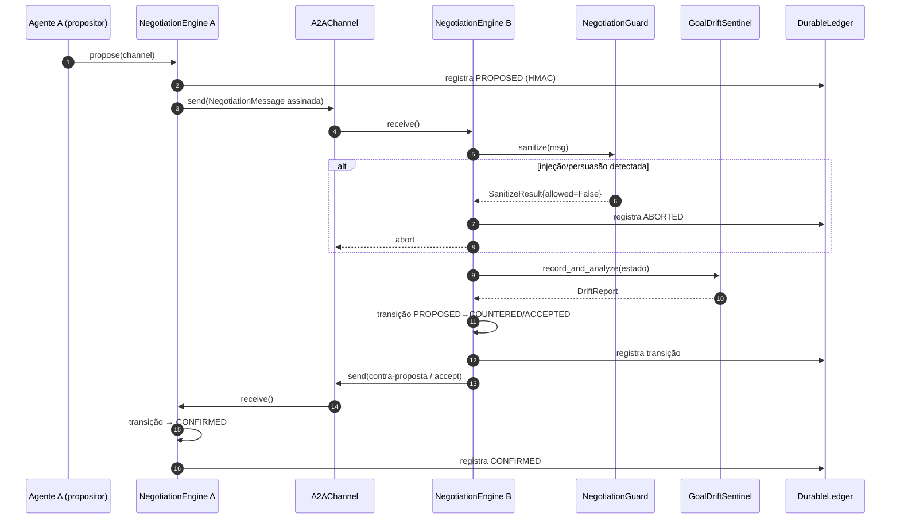
```mermaid
sequenceDiagram
    autonumber
    participant A as Agente A (propositor)
    participant EA as NegotiationEngine A
    participant CH as A2AChannel
    participant EB as NegotiationEngine B
    participant G as NegotiationGuard
    participant SEN as GoalDriftSentinel
    participant LG as DurableLedger

    A->>EA: propose(channel)
    EA->>LG: registra PROPOSED (HMAC)
    EA->>CH: send(NegotiationMessage assinada)
    CH->>EB: receive()
    EB->>G: sanitize(msg)
    alt injeção/persuasão detectada
        G-->>EB: SanitizeResult{allowed=False}
        EB->>LG: registra ABORTED
        EB-->>CH: abort
    end
    EB->>SEN: record_and_analyze(estado)
    SEN-->>EB: DriftReport
    EB->>EB: transição PROPOSED→COUNTERED/ACCEPTED
    EB->>LG: registra transição
    EB->>CH: send(contra-proposta / accept)
    CH->>EA: receive()
    EA->>EA: transição → CONFIRMED
    EA->>LG: registra CONFIRMED
```

**Notas de design:**
- Toda transição de estado é **persistida e assinada** — a negociação inteira é reconstituível a partir do ledger (base para o `ArenaReporter`).
- O `GoalDriftSentinel` monitora deriva de objetivo **durante** a negociação, não apenas ao final — detecção precoce de desalinhamento.

### 6.5 · Contestação (Appeal) com SLA de 24h

**Objetivo:** o direito de contestar uma decisão automatizada (LGPD Art. 20 / EU AI Act Art. 14).

**Escopo:** `/v1/appeals` (submeter, JWT) e `/v1/appeals/{id}/resolve` (resolver, HITL).

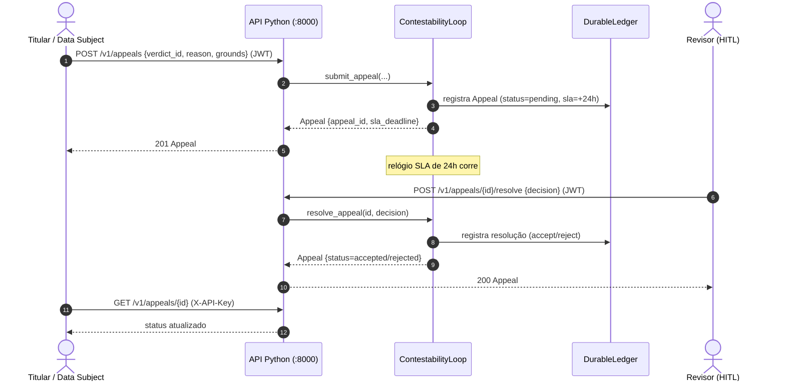
```mermaid
sequenceDiagram
    autonumber
    actor U as Titular / Data Subject
    participant API as API Python (:8000)
    participant CL as ContestabilityLoop
    participant LG as DurableLedger
    actor R as Revisor (HITL)

    U->>API: POST /v1/appeals {verdict_id, reason, grounds}  (JWT)
    API->>CL: submit_appeal(...)
    CL->>LG: registra Appeal (status=pending, sla=+24h)
    CL-->>API: Appeal {appeal_id, sla_deadline}
    API-->>U: 201 Appeal
    Note over CL: relógio SLA de 24h corre
    R->>API: POST /v1/appeals/{id}/resolve {decision}  (JWT)
    API->>CL: resolve_appeal(id, decision)
    CL->>LG: registra resolução (accept/reject)
    CL-->>API: Appeal {status=accepted/rejected}
    API-->>R: 200 Appeal
    U->>API: GET /v1/appeals/{id}  (X-API-Key)
    API-->>U: status atualizado
```

**Notas de design:**
- Escrita de appeal exige **JWT** (identidade forte); leitura aceita `X-API-Key`. A resolução é **human-in-the-loop** obrigatória.
- O SLA de 24h é métrica de primeira classe (`/v1/appeals/metrics`) — conformidade auditável, não promessa.

---

## 7 · Diagramas de Atividades

### 7.1 · Pipeline do Gatekeeper (22 módulos, fail-secure)

**Objetivo:** o processamento interno de `scan_for_evidence`, com seus caminhos de saída antecipada e a re-verificação de conteúdo decodificado.

**Escopo:** `rust/kernel/src/gatekeeper.rs`.

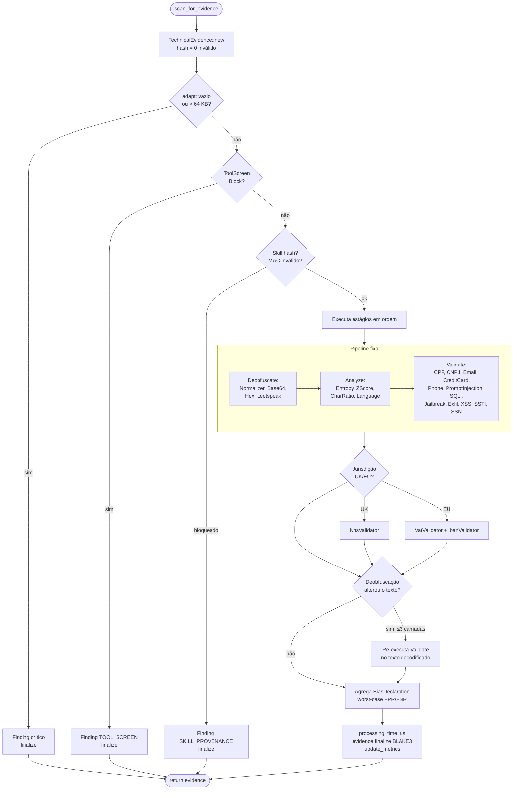
```mermaid
flowchart TD
    start([scan_for_evidence]) --> ev[TechnicalEvidence::new<br/>hash = 0 inválido]
    ev --> adapt{adapt: vazio<br/>ou > 64 KB?}
    adapt -->|sim| crit1[Finding crítico<br/>finalize] --> ret([return evidence])
    adapt -->|não| tool{ToolScreen<br/>Block?}
    tool -->|sim| crit2[Finding TOOL_SCREEN<br/>finalize] --> ret
    tool -->|não| supply{Skill hash?<br/>MAC inválido?}
    supply -->|bloqueado| crit3[Finding SKILL_PROVENANCE<br/>finalize] --> ret
    supply -->|ok| stages[Executa estágios em ordem]

    subgraph pipe["Pipeline fixa"]
        deob[Deobfuscate:<br/>Normalizer, Base64,<br/>Hex, Leetspeak]
        ana[Analyze:<br/>Entropy, ZScore,<br/>CharRatio, Language]
        val[Validate:<br/>CPF, CNPJ, Email, CreditCard,<br/>Phone, PromptInjection, SQLi,<br/>Jailbreak, Exfil, XSS, SSTI, SSN]
        deob --> ana --> val
    end
    stages --> pipe
    pipe --> juris{Jurisdição<br/>UK/EU?}
    juris -->|UK| nhs[NhsValidator]
    juris -->|EU| eu[VatValidator + IbanValidator]
    juris --> rescan{Deobfuscação<br/>alterou o texto?}
    nhs --> rescan
    eu --> rescan
    rescan -->|sim, ≤3 camadas| reval[Re-executa Validate<br/>no texto decodificado]
    rescan -->|não| bias
    reval --> bias[Agrega BiasDeclaration<br/>worst-case FPR/FNR]
    bias --> fin[processing_time_us<br/>evidence.finalize BLAKE3<br/>update_metrics]
    fin --> ret
```

**Notas de design:**
- **Três portões de saída antecipada** (adapt/tool-screen/supply-guard) emitem sempre um `Finding` crítico antes de retornar — nunca um veredito "vazio".
- O **re-scan (Stage 3.5)** é a defesa contra ataques ofuscados em camadas (ex.: base64 dentro de hex): decodifica até 3 camadas (cap de 5 ms) e re-roda os validadores no texto final.
- A `BiasDeclaration` agregada é **worst-case** (maior FPR/FNR, calibração mais antiga) — declara honestamente a incerteza do pipeline.

### 7.2 · Cadeia de guardas de `/v1/agent/decide`

**Objetivo:** a governança de **ações estruturadas** de agente (ADR-029), com portões sequenciais fail-secure.

**Escopo:** `api/routes/agent_decide.py`.

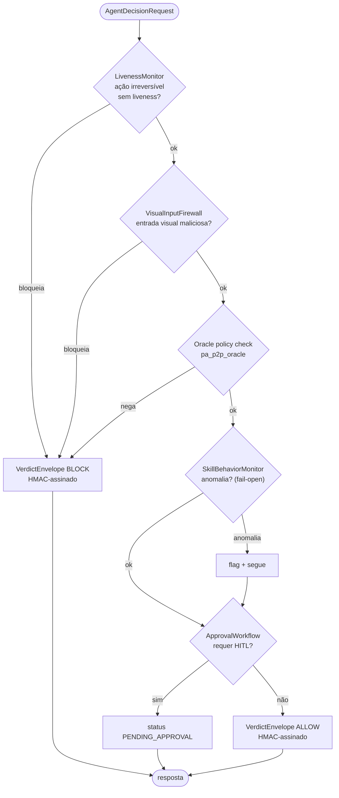
```mermaid
flowchart TD
    req([AgentDecisionRequest]) --> live{LivenessMonitor<br/>ação irreversível<br/>sem liveness?}
    live -->|bloqueia| block[VerdictEnvelope BLOCK<br/>HMAC-assinado] --> out([resposta])
    live -->|ok| vis{VisualInputFirewall<br/>entrada visual maliciosa?}
    vis -->|bloqueia| block
    vis -->|ok| oracle{Oracle policy check<br/>pa_p2p_oracle}
    oracle -->|nega| block
    oracle -->|ok| skill{"SkillBehaviorMonitor<br/>anomalia? (fail-open)"}
    skill -->|anomalia| flag[flag + segue]
    skill -->|ok| appr
    flag --> appr{ApprovalWorkflow<br/>requer HITL?}
    appr -->|sim| pending[status PENDING_APPROVAL] --> out
    appr -->|não| allow[VerdictEnvelope ALLOW<br/>HMAC-assinado] --> out
```

**Notas de design:**
- A maioria dos guardas é **fail-secure** (exceção → BLOCK); `SkillBehaviorMonitor` é deliberadamente **fail-open** (anomalia apenas sinaliza, não bloqueia) para evitar falsos positivos em telemetria comportamental.
- Ações **irreversíveis** recebem escrutínio extra no `LivenessMonitor` — coerente com o `Reversibility`/`EffectLog` do kernel.

### 7.3 · Consumo de tokens lineares no Executivo

**Objetivo:** visualizar a garantia de tipo-linear como um fluxo de recursos que não pode ser "desviado".

**Escopo:** `btv-executive::Executive::decide`.

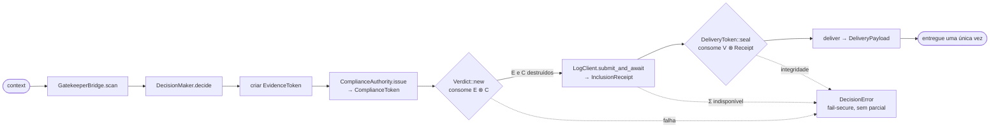
```mermaid
flowchart LR
    ctx([context]) --> scan[GatekeeperBridge.scan]
    scan --> dec[DecisionMaker.decide]
    dec --> etok[criar EvidenceToken]
    etok --> ctok[ComplianceAuthority.issue<br/>→ ComplianceToken]
    ctok --> verd{Verdict::new<br/>consome E ⊗ C}
    verd -->|E e C destruídos| submit[LogClient.submit_and_await<br/>→ InclusionReceipt]
    submit --> seal{DeliveryToken::seal<br/>consome V ⊗ Receipt}
    seal --> deliver[deliver → DeliveryPayload]
    deliver --> done([entregue uma única vez])
    verd -.->|falha| err[DecisionError<br/>fail-secure, sem parcial]
    submit -.->|Σ indisponível| err
    seal -.->|integridade| err
```

**Notas de design:**
- Não há variante de "resultado parcial" em `DecisionError` — o pipeline é **all-or-nothing**. Nenhuma decisão é entregue sem recibo de inclusão em Σ.
- Cada `⊗` é um ponto onde o compilador Rust garante consumo único; tentar reutilizar um token é erro de compilação (E0382 use-after-move).

---

## 8 · Diagrama de Implantação

**Objetivo:** a topologia física — containers, portas, redes e protocolos.

**Escopo:** `ops/docker-compose.yml` + `ops/k8s/*` + `ops/nginx` + `fly.toml`.

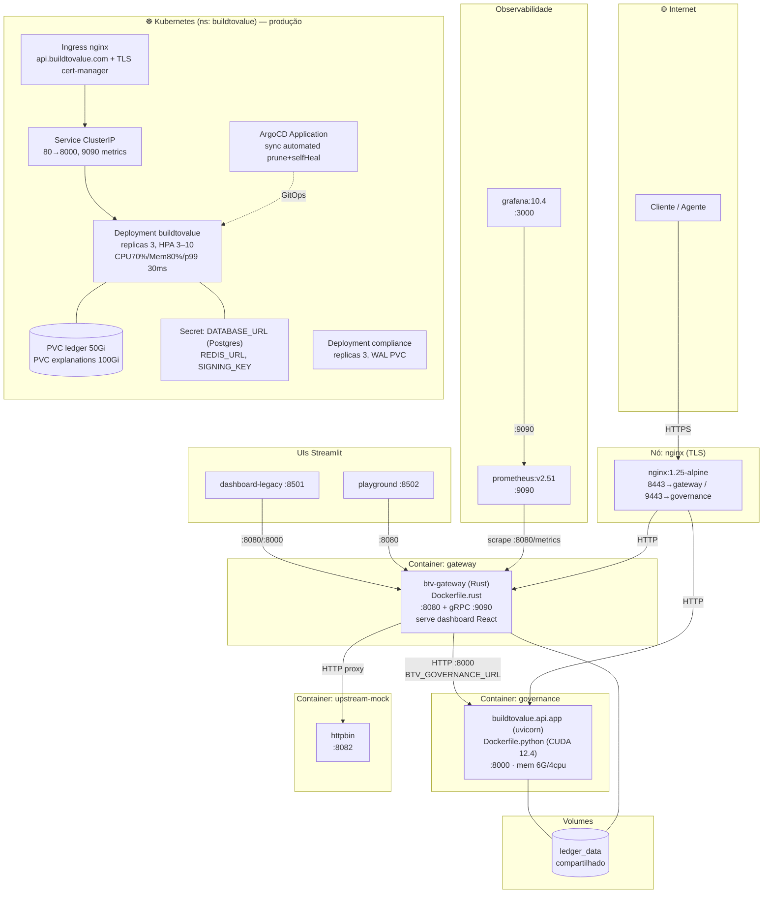
```mermaid
flowchart TB
    subgraph internet["🌐 Internet"]
        user["Cliente / Agente"]
    end

    subgraph node_edge["Nó: nginx (TLS)"]
        nginx["nginx:1.25-alpine<br/>8443→gateway / 9443→governance"]
    end

    subgraph node_gw["Container: gateway"]
        gw["btv-gateway (Rust)<br/>Dockerfile.rust<br/>:8080 + gRPC :9090<br/>serve dashboard React"]
    end

    subgraph node_py["Container: governance"]
        py["buildtovalue.api.app (uvicorn)<br/>Dockerfile.python (CUDA 12.4)<br/>:8000 · mem 6G/4cpu"]
    end

    subgraph node_up["Container: upstream-mock"]
        up["httpbin<br/>:8082"]
    end

    subgraph node_obs["Observabilidade"]
        prom["prometheus:v2.51<br/>:9090"]
        graf["grafana:10.4<br/>:3000"]
    end

    subgraph node_ui["UIs Streamlit"]
        play["playground :8502"]
        dash["dashboard-legacy :8501"]
    end

    subgraph vols["Volumes"]
        led[("ledger_data<br/>compartilhado")]
    end

    user -->|HTTPS| nginx
    nginx -->|HTTP| gw
    nginx -->|HTTP| py
    gw -->|HTTP :8000<br/>BTV_GOVERNANCE_URL| py
    gw -->|HTTP proxy| up
    gw --- led
    py --- led
    prom -->|scrape :8080/metrics| gw
    graf -->|:9090| prom
    play -->|:8080| gw
    dash -->|:8080/:8000| gw

    subgraph k8s["☸️ Kubernetes (ns: buildtovalue) — produção"]
        direction TB
        ingress["Ingress nginx<br/>api.buildtovalue.com + TLS cert-manager"]
        depapi["Deployment buildtovalue<br/>replicas 3, HPA 3–10<br/>CPU70%/Mem80%/p99 30ms"]
        depcomp["Deployment compliance<br/>replicas 3, WAL PVC"]
        svc["Service ClusterIP<br/>80→8000, 9090 metrics"]
        pvc[("PVC ledger 50Gi<br/>PVC explanations 100Gi")]
        secret["Secret: DATABASE_URL (Postgres)<br/>REDIS_URL, SIGNING_KEY"]
        ingress --> svc --> depapi
        depapi --- pvc
        depapi --- secret
        argocd["ArgoCD Application<br/>sync automated prune+selfHeal"] -.->|GitOps| depapi
    end
```

**Notas de design:**
- **Dev/Compose:** um único `ledger_data` é compartilhado entre `gateway` e `governance` — acoplamento de estado a observar (concorrência de escrita mediada pelo `TenantStorageRouter`/WAL do kernel).
- **Prod/k8s:** o Deployment usa `RollingUpdate maxUnavailable: 0`, `podAntiAffinity`, `runAsNonRoot`, NetworkPolicy restritiva (egress só DNS/Postgres/Redis/HTTPS) e um `initContainer` que **valida políticas** antes de subir — fail-secure no deploy.
- **HPA por latência:** além de CPU/memória, escala por métrica custom `http_request_duration_p99` (alvo 30 ms) — coerente com o SLA do gateway.
- **Limitação conhecida (README):** o gateway não termina TLS por si — depende do nginx/Ingress; rotação de ledger ainda não implementada (cresce indefinidamente).

---

## 9 · Análise de coesão, acoplamento e refatoramento

### 9.1 Pontos fortes arquiteturais

- **Separação de poderes com isolamento imposto por compilador/CI.** `btv-judicial` verifica sem importar `btv-core`; `btv-types` é folha do grafo. Poucos sistemas conseguem *provar* independência de verificação — aqui ela é estrutural.
- **Tipos lineares como política de segurança.** Modelar evidência/veredito/recibo como recursos `#[must_use]` sem `Clone` transforma invariantes de negócio ("não entregue sem prova") em erros de compilação. Coesão altíssima no `btv-core`.
- **Fail-secure consistente** em todas as linguagens: kernel (evidência nasce inválida), Python (exceção → BLOCK assinado), FFI (sem fallback silencioso), executivo (sem resultado parcial).
- **Explicabilidade no contrato.** As quatro racionalidades (Rawls/Levinas/Jonas/Gilligan) atravessam FFI → Python → SDK até o cliente. Auditoria e contestabilidade são cidadãs de primeira classe.
- **Boa gestão de resiliência do upstream** (circuit breaker + fallback por prioridade) e de acoplamento temporal (auditoria via MPSC desacoplada do hot path).

### 9.2 Acoplamentos e riscos

| Área | Observação | Severidade |
|---|---|---|
| `python/buildtovalue/governance/` | "Pacote-deus" com ~90 módulos e responsabilidades heterogêneas (política, appeals, drift, RAG, detectores, ledger, mercy). Alto acoplamento aferente. | 🔴 Alta |
| FFI | **Duas** definições de `#[pymodule] buildtovalue_kernel` (`bindings` vs `kernel/ffi/bridge`) com APIs divergentes de `RustKernel`; `rust_validators.py` procura ainda um terceiro nome de `.so`. | 🟠 Média |
| `EthicalContextEngine` duplicado | Versão canônica (`ethical_context_engine.py`) e legada (`context_engine.py`) coexistem; só o gateway usa a legada. | 🟠 Média |
| Colisão de nomes de tipos | Três `TechnicalEvidence`, dois `Decision`, dois `BiasDeclaration`, dois `AppealRecord`/`NegotiationDeadlockReason` entre crates. Confunde leitura e ferramentas. | 🟡 Baixa |
| Gateway multifuncional | Segurança de borda + scan + proxy + auditoria num só binário — alto fan-in, SPOF operacional. | 🟡 Baixa |
| Estado de ledger compartilhado (Compose) | `ledger_data` montado por dois serviços; correção depende de disciplina do WAL/router. | 🟡 Baixa |
| Duas topologias | Pipeline sidecar (gateway↔Python) vs República pura-Rust — não está evidente em runtime qual está "no comando"; risco de divergência semântica de `Decision`. | 🟠 Média |

### 9.3 Oportunidades de refatoramento (priorizadas)

1. **Subdividir `governance/` em subpacotes coesos** seguindo os subsistemas já identificados: `policy/`, `ethics/` (ece_*, mercy, gilligan), `contestability/`, `drift/`, `ledger/`, `agent_pdp/`, `context/`, `rag/`, `detectors/`, `integrity/`. Reduz o cone de dependência e habilita testes por subsistema. *(Alto valor, esforço médio.)*
2. **Consolidar a fronteira FFI** numa única definição de `buildtovalue_kernel` e um único nome de `.so`. Documentar o contrato JSON (`FindingWire`/`BiasWire`) como schema versionado. *(Baixo risco, alto valor.)*
3. **Unificar os dois `EthicalContextEngine`**, migrando o gateway para o motor canônico e removendo o legado (ou marcando-o `@deprecated` com data de remoção). *(Médio.)*
4. **Introduzir tipos wire canônicos únicos** (`btv-types`) e fazer kernel/core/executivo re-exportarem em vez de redefinirem `TechnicalEvidence`/`Decision`/`BiasDeclaration`. Elimina a classe inteira de bugs de conversão. *(Médio/alto esforço, alto valor.)*
5. **Explicitar a relação entre as duas topologias** (sidecar vs República). Ou o gateway delega a decisão à cadeia `executive→Σ→judicial`, ou a documentação declara que a República é um pipeline paralelo experimental — hoje há dois caminhos com semânticas de `Decision` diferentes.
6. **Rotação de ledger** (limitação conhecida): implementar segmentação/arquivamento com âncora de continuidade de hash entre segmentos, antes que o crescimento ilimitado vire risco operacional.

### 9.4 Ausências justificadas

- **Diagrama de estados dedicado** não foi separado: os dois estados relevantes (`NegotiationState` da negociação A2A e `ChainStatus`/`SystemState` da República) já aparecem como enums nos diagramas de classe e no fluxo de atividade §7.3 — um diagrama de estados isolado seria redundante.
- **Diagrama de objetos** foi omitido: o sistema tem poucos singletons de longa vida (injetados via `app.state`/`AppState`); instâncias são efêmeras por requisição, tornando um snapshot de objetos pouco informativo.

---

> **Nota de rastreabilidade.** Todos os nomes de tipos, classes, rotas e arquivos deste documento foram extraídos por análise estática direta do código-fonte (caminhos citados ao longo do texto). Para o mapa completo de arquivos por subsistema, cruze com a árvore da §1.1.

