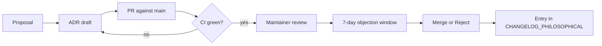

# CAP — Constitutional Amendments

**CAP** is the formal process to change the BuildToValue constitution — its
body of ADRs, YAML policies, and ethical thresholds. It ensures that
significant changes are:

1. **Traceable** — every amendment references ledger evidence.
2. **Contestable** — every amendment has a formal objection window.
3. **Verifiable** — every amendment passes through `validate_invariants.py`
   and `mkdocs build --strict`.

## Flow

## When to use

- **Use CAP** for: new ADRs, ethical threshold changes, byte-invariant changes,
  ADR renumbering.
- **Do not use CAP** for: typos, dependency updates, internal refactors with no
  constitutional effect.

## Change types

| Type | Objection window | Approval |
| --- | --- | --- |
| New ADR | 7d | 2 maintainers |
| Ethical threshold | 14d | 2 maintainers + 1 judge |
| Byte invariant | 30d | Consensus + entry in `CHANGELOG_PHILOSOPHICAL.md` |

## How to contribute

See [Tutorial 04](tutorials/04-propose-policy.md) and
[`CONTRIBUTING.md`](https://github.com/danzeroum/BuildToValueGovernance/blob/main/CONTRIBUTING.md).
