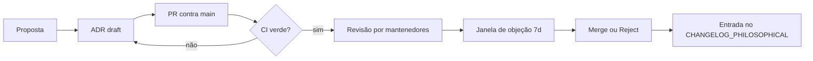

# Protocolo CAP — Emendas Constitucionais

O **CAP** é o processo formal para alterar a constituição do BuildToValue —
seu corpo de ADRs, políticas YAML e thresholds éticos. Ele garante que
mudanças significativas sejam:

1. **Rastreáveis** — toda emenda referencia evidências do ledger.
2. **Contestáveis** — toda emenda tem janela de objeção formal.
3. **Verificáveis** — toda emenda passa por `validate_invariants.py` e `mkdocs build --strict`.

## Fluxo

## Quando usar

- **Use CAP** para: novos ADRs, mudança de threshold ético, alteração de
  invariantes de bytes, renumeração de ADRs.
- **Não use CAP** para: typos, atualização de dependências, refactors internos
  sem efeito constitucional.

## Tipos de mudança

| Tipo | Janela de objeção | Quem aprova |
| --- | --- | --- |
| Novo ADR | 7d | 2 mantenedores |
| Threshold ético | 14d | 2 mantenedores + 1 juiz |
| Invariante de bytes | 30d | Consenso + entrada no `CHANGELOG_PHILOSOPHICAL.md` |

## Como contribuir

Veja o [Tutorial 04](tutorials/04-propose-policy.md) e o
[`CONTRIBUTING.md`](https://github.com/danzeroum/BuildToValueGovernance/blob/main/CONTRIBUTING.md).
