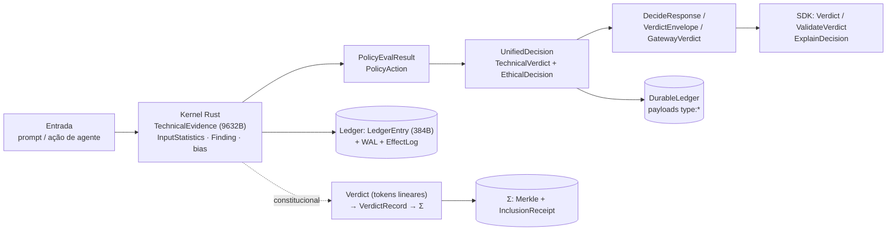

# Mapa de Dados — Repositório BuildToValueGovernance

> **Dicionário de dados completo** de todo o repositório: todos os dados de **entrada**, **processamento intermediário** e **saída** que circulam pelo sistema, em Rust, Python, TypeScript e HTML/JS — a nível de campo, com a origem no código.
> Gerado por análise estática de todos os scripts. Complementa a [Arquitetura UML](../arquitetura-uml.md) e a [Arquitetura Completa C4](../arquitetura-completa.md).

## Objetivo e método

Este mapa responde à pergunta "**quais dados circulam no sistema?**" enumerando, para cada script, os elementos portadores de dados: structs, enums, classes, dataclasses, TypedDicts, interfaces, modelos Pydantic, constantes de configuração, esquemas de tabela, corpos HTTP e formatos wire. Para cada elemento registramos:

- **Entity + arquivo** — nome exato (case-sensitive) e origem.
- **Kind** — struct/enum/dataclass/class/TypedDict/Protocol/interface/const/tabela.
- **Campos** — todos os campos com tipo (e defaults/constraints/layout de bytes quando relevante).
- **Role** — o papel no fluxo de dados:
  - **INPUT** — vem de fora (usuário, HTTP, FFI, env, arquivo).
  - **INTERMEDIATE** — computado/retido durante o processamento, **mesmo que descartado dentro da própria classe**.
  - **OUTPUT** — retornado/serializado ao chamador.
  - **PERSISTED** — gravado em ledger, SQLite, WAL, disco ou Σ.
- **Flows** — produtor/consumidor e serialização (BLAKE3/HMAC/Ed25519/serde_json/bincode/repr(C)).

## Arquivos deste mapa

| # | Arquivo | Cobertura |
|---|---|---|
| 01 | [rust-kernel](01-rust-kernel.md) | Kernel: types, evidence (9632B), findings, ledger, deobfuscator, interceptor, compliance, FFI, security, pattern registry |
| 02 | [rust-gateway-constitucional](02-rust-gateway-constitucional.md) | Gateway (rotas/middleware/estado/auditoria) + btv-core/types/executive/judicial/governance/redaction/sigma/bindings/cli |
| 03 | [python-governance](03-python-governance.md) | ~90 módulos de governança (política, ética, contestabilidade, drift, ledger, detectores, PDP, consenso) |
| 04 | [python-api-compliance](04-python-api-compliance.md) | API FastAPI (modelos Pydantic, rotas, SQLite, webhooks) + compliance (plugins, ROPA/FRIA/Art.20) |
| 05 | [python-intelligence-agentic-core](05-python-intelligence-agentic-core.md) | LLM/SLM/NER/threat-intel, negociação A2A, orquestradores core, observabilidade, segurança |
| 06 | [sdk-typescript-html-spec](06-sdk-typescript-html-spec.md) | SDK TS/Python, integrações, MCP, dashboards HTML/Streamlit/JS, OpenAPI, agent-pdp |

## Panorama do fluxo de dados

## Categorias de dados que circulam

| Categoria | Exemplos (arquivo detalha) |
|---|---|
| **Evidência de scan** | TechnicalEvidence (kernel 9632B / btv-types 9596B / FFI compacta / Python dataclass), InputStatistics, Finding (144B), BiasDeclaration (512B/104B/Vec/V2) |
| **Estatística/análise** | entropy, z_score, digit/letter/symbol_ratio, unique_chars, instruction_density, leet_ratio, drift scores |
| **Veredito/decisão** | ActionType, AgentVerdict, PolicyEvalResult, TechnicalVerdict, EthicalDecision, UnifiedDecision, GatewayVerdict, VerdictEnvelope, DecideResponse |
| **Contestabilidade** | Appeal, AppealStatus, EthicalVerdict, EscalationEvent, ManifestAppealResult, AppealRecord |
| **Ledger/proveniência** | LedgerEntry (hash-chain), WalEntry, EffectEntry, SessionAggregate, DurableLedger payloads (`type:` discriminado), MemoryProvenanceRecord, DelegationRecord, WorkContract, CommitEntry |
| **Identidade/crypto** | verdict_id, hmac_seal/hmac_tag/hmac_sha256, signature (Ed25519/HMAC), blake3_hash, merkle_root, InclusionReceipt, RatificationProof, MandateToken |
| **Configuração/política** | PolicyRule, Profile, SectorPatterns, ToolPolicy, BudgetLimits, RefusalConfig, RedactionConfig, StoneClause |
| **Threat-intel** | ThreatEvent, Classification, GeneratedPolicy, BridgeSyncResult, tabela SQLite `threats` |
| **Multi-agente (A2A)** | NegotiationMessage, NegotiationResult, ProtocolSpec/Plan, DegradationReport, ArenaReport, Step |
| **Telemetria** | métricas Prometheus (`buildtovalue_*`, `btv_*`), FairnessAuditEvent, spans OTel, JSONFormatter log_data |
| **Wire/contrato** | DecideRequest/Response, GovernanceDecideRequest/Verdict, openapi schemas, agent-pdp-v1.json, TS interfaces |

## Armazenamentos persistentes (onde os dados "param")

| Sink | Conteúdo | Origem |
|---|---|---|
| Ledger criptográfico Rust (WAL + bincode 384B encadeado) | LedgerEntry, evidence snapshot | kernel `ledger/` |
| `data/ledger/decisions.jsonl` | decisão por linha (ts, verdict_id, action, risk, findings…) | Rust `validate.rs`, lido por `LedgerReader` |
| `DurableLedger` (BLAKE2b + HMAC in-process) | payloads `type:` (rag_provenance, skill_action, oracle_*, kill_switch_*, refusal_record…) | governance/agentic |
| SQLite `sessions`/`agent_pubkeys` (trust.db) | trust_score, offenses, pubkeys | api `_db.py` |
| SQLite `users` (users.db) | credenciais bcrypt | api `auth.py` |
| SQLite `appeals` (appeals.db) | contestações + SLA | governance contestability |
| SQLite `explanations` | explicações completas (JSON, ret. 90d) | governance explanation_store |
| SQLite `privacy_usage` | orçamento de dados sensíveis | governance privacy_budget |
| SQLite `escrow_ledger` | escrow de trust | governance trust_score |
| SQLite `threats` (threats.db) | threat-intel | intelligence threat_feed |
| Σ Transparency Log (Merkle + Ed25519) | VerdictRecord, RedactionReceipt, Mandate | btv-sigma |
| `data/policies/auto-generated/*.yaml` | políticas geradas (nascem desabilitadas) | intelligence threat_policy_bridge |
| Volume `ledger_data` / PVC | ledgers compartilhados | ops |

## Catálogo global de variáveis de ambiente

Todas as variáveis lidas em qualquer linguagem (Rust + Python + SDK + ops + demo + benchmarks).

| Var | Onde é lida | Uso | Default |
|---|---|---|---|
| `BTV_ENV` | gateway (state/auth/tenant), kernel/keys, api (app/auth), security/keys | ambiente (development/staging/production); gate de hardening | development |
| `BTV_HMAC_KEY` | btv-core/hmac, btv-judicial/hmac_verify, kernel/keys, security/keys | chave HMAC de selo de veredito/política; removida do environ após leitura | (nenhum; prod obrigatório) |
| `BTV_API_KEYS` | gateway/middleware/auth, api/auth, demo/proxy | chaves de API válidas (X-API-Key) | "" |
| `BTV_API_KEY` | mcp-server, benchmarks | chave de API do cliente | "" (MCP obrigatório) |
| `BTV_GATEWAY_URL` | mcp, dashboard, pattern_registry_client, SDK, e2e | URL do gateway Rust | http://localhost:8080 |
| `BTV_GOVERNANCE_URL` | gateway rotas (trust/common/health_bias/validate/decide), dashboard | URL da governança Python | http://localhost:8000 |
| `BTV_JWT_SECRET` | gateway/middleware (auth/tenant), api/routes/auth | segredo JWT HS256 | (nenhum) |
| `BTV_ADMIN_PASSWORD` | api/routes/auth | senha seed do admin (só se tabela vazia) | admin |
| `BTV_USERS_DB` | api/routes/auth | SQLite de usuários | data/users.db |
| `BTV_DB_PATH` | api/_db, governance/trust_score | SQLite trust/escrow | data/trust.db |
| `BTV_APPEALS_DB` | api/_lifespan, contestability/_loop | SQLite de appeals | data/appeals.db |
| `BTV_THREATS_DB` | intelligence/threat_feed | SQLite de ameaças | data/threats.db |
| `BTV_POLICY_DIR` | api (webhook/agents/lifespan), compliance, governance (sector/risk) | raiz de políticas YAML | data/policies |
| `BTV_POLICIES_DIR` | gateway/state | diretório de políticas (Rust) | (fallback) |
| `BTV_AUTOGEN_DIR` | api/routes/intelligence | políticas auto-geradas | data/policies/auto-generated |
| `BTV_TENANT_DATA_DIR` | gateway/state | dados por tenant | /data/tenants |
| `BTV_AUDIT_DIR` | gateway/state | auditoria forense | audit/entries |
| `BTV_AUDIT_TTL_DAYS` / `BTV_AUDIT_HASH_LEDGER` / `BTV_AUDIT_KEY` | ADR-0052 | retenção / hash ledger / chave | 90 / data/ledger/audit_hashes.jsonl / (nenhum) |
| `BTV_KERNEL_WORKERS` | api/_lifespan | threadpool do kernel | 4 |
| `BTV_SLM_MODEL_PATH` / `BTV_SLM_*` | api/app, _lifespan | caminho do modelo SLM local | (unset) |
| `BTV_CORS_ORIGINS` | api/app | origens CORS (prod obrigatório) | "" |
| `BTV_PROBLEM_TYPE_BASE` | api/app | base URI do RFC7807 | https://btv.example.com/problems |
| `BTV_RATE_LIMIT_RPM` | gateway/middleware/rate_limit | req/min | 60 |
| `BTV_RATE_LIMIT_MAX` / `BTV_RATE_LIMIT_WINDOW_SECS` | python/.env.example | rate limit py | 100 / 60 |
| `BTV_RL_FREE/STANDARD/ENTERPRISE_RPM` | ADR-0040 | limites por tier | (numérico) |
| `BTV_INTERNAL_SECRET` | gateway/middleware/internal_auth, audit/grpc_exposer | chave de endpoints internos (≥32B) | (ausente→nega em prod) |
| `BTV_PROXY_UPSTREAM_URL` | gateway/routes/proxy, compose | LLM upstream do proxy | https://api.openai.com |
| `BTV_SIGMA_ENDPOINT` | btv-governance/bridge, btv-judicial/ledger_query | endpoint de Σ | (set) |
| `BTV_LOG_ENDPOINT` / `BTV_LOG_VERIFYING_KEY` | btv-core/log_client, btv-judicial/ed25519_verify, btv-sigma/main | endpoint Σ / pubkey Ed25519 | :3100 / (set) |
| `BTV_POLICY_PUBKEY_PATH` | governance/policy_loader | pubkey Ed25519 do comitê de ética | (unset→gate) |
| `BTV_POLICY_HMAC_KEY` / `BTV_POLICY_SIGNING_KEY` | scripts/policy_signer | chaves de assinatura (CLI) | "" |
| `BTV_PATTERN_EPOCH` | governance/pattern_registry_client | pin do epoch de padrões | (unset) |
| `BTV_TEE_PUBKEY` | sectors/aerospace.yaml | pubkey de atestação TEE | "" |
| `BTV_PHI3_MANIFEST_HASH` | model_integrity.yaml, manifest_hash_verifier | hash esperado do manifesto do modelo | (unset) |
| `BUILDTOVALUE_KERNEL_LIB` | ffi/rust_validators | caminho do .so do kernel | (autodetect) |
| `PORT` / `GRPC_PORT` | gateway/main | porta HTTP / gRPC | 8080 / (numérico) |
| `OTEL_EXPORTER_OTLP_ENDPOINT` / `ENVIRONMENT` | gateway/main, kernel/tracing, api/app, observability/tracing | export OTLP / tag de ambiente | http://localhost:4317 / development |
| `RUST_LOG` | compose, k8s configmap | nível de log Rust | info |
| Demo (`demo/proxy.py`) | `BTV_DEMO_KEY`, `BTV_API_BASE`, `BTV_DEMO_USER`, `BTV_DEMO_PASSWORD`, `BTV_RUST_BASE`, `BTV_DEMO_PORT`, `DEEPSEEK_API_KEY`, `DEEPSEEK_BASE` | serviço/auth/LLM de demo | conforme código |
| Benchmarks | `NEMO_GUARDRAILS_URL`, `BEDROCK_GUARDRAIL_ID`, `AWS_REGION`, `PROMPT_SECURITY_API_KEY`, `LAKERA_API_KEY` | credenciais de concorrentes | conforme código |
| k8s ConfigMap | `BUILDTOVALUE_ENV`, `LOG_LEVEL`, `MAX_BATCH_SIZE`, `BATCH_TIMEOUT_MS`, `CONSTANT_TIME_VALIDATION`, `JITTER_PERCENT`, `TRUST_DECAY_HALF_LIFE_HOURS`, `MERCY_THRESHOLD_LOW/HIGH`, `WAL_CAPACITY`, `FLUSH_INTERVAL_SECONDS`, `METRICS_PORT`, `HEALTH_CHECK_INTERVAL_SECONDS` | config de deploy | ver manifesto |
| k8s Secret | `DATABASE_URL`, `REDIS_URL`, `SIGNING_KEY`, `SMTP_PASSWORD`, `GF_ADMIN_PASSWORD` | segredos | (nenhum) |

## Observações transversais de dados

- **Duplicações canônicas** (sempre desambiguar por arquivo): `TechnicalEvidence` (kernel 9632B / btv-types 9596B / bindings C-FFI / Python types.py / Python ffi_client.py), `Decision` (kernel 6 / btv-types 3), `BiasDeclaration` (kernel 512B / btv-types Vec / btv-types Fixed 104B / ffi_client / synthetic_dataset / persuasion V2), `EthicalVerdict` (context_engine_types / contestability/_types), `MandateWire` (btv-types / btv-governance), `AppealRecord` (kernel fixed / btv-types String).
- **Assinatura de integridade onipresente:** quase todo DTO de saída carrega `signature`/`hmac_*` (HMAC-SHA256) ou Ed25519; a evidência e o ledger usam BLAKE3/BLAKE2b encadeado; Σ usa Merkle SHA-256.
- **Discriminador `type:` do DurableLedger** é o "esquema" de facto de muitos dados persistidos no Python (ver mapa 03).
- **Discrepâncias de contrato reais** encontradas (candidatas a correção — não alteradas): `VerdictAction` diverge entre OpenAPI (8), SDK (6) e demo (REVIEW); campos de `sanitize` diferem entre SDK (`sanitized`/`redactions`) e Streamlit (`sanitized_text`/`masked_count`); `appeals` usa `verdict_id` (SDK/OpenAPI) vs `audit_trail_id` (Streamlit); `ledger_analytics.py` usa API inexistente de `LedgerQuery`/`LedgerResult`; `policy_tester.py` referencia `TestCategory` indefinido; `grants` dry-run constrói `Verdict` incompleto.
- **Único caminho fail-open** entre os detectores: `VisualReasoningGuard`. Todos os demais falham para BLOCK/EXHAUSTED/abliterated.
